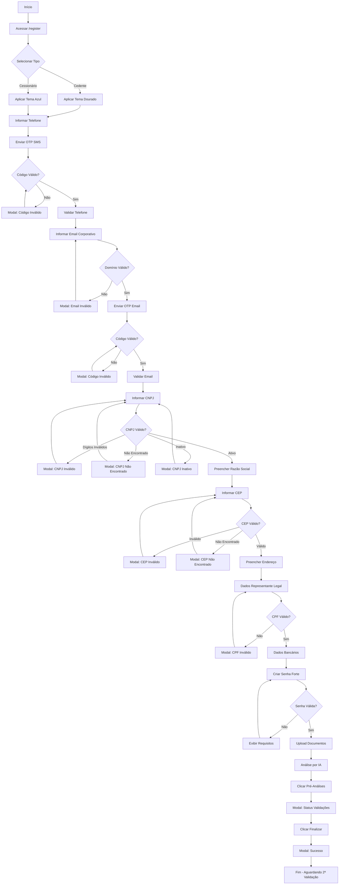

# MARKETPLACE DE CESSÃO DE CRÉDITO CONSIGNADO - (UC-001)

**Versão:** 1.0.0  
**Data de Criação:** 03/02/2026  
**Última Atualização:** 03/02/2026  

---

## 1. Identificação e Resumo

| Campo | Valor |
|-------|-------|
| **ID/Nome** | UC-001 Habilitar Participante no Marketplace |
| **Prioridade** | Alta |
| **Versão** | 1.0.0 |
| **Status** | Implementado |
| **Ator Primário** | Instituição Financeira (Cedente ou Cessionário) |
| **Ator Secundário** | Administrador Marketplace (BackOffice) |
| **Descrição** | Permitir que uma instituição financeira se cadastre na plataforma CreditFlow como Cedente, Cessionário ou ambos, passando por validações de OTP (telefone e email), dados cadastrais, dados do representante legal, dados bancários e upload de documentos, com análise automática por IA e validações em órgãos reguladores. |

---

## 2. Contexto de Negócio e Engenharia

### Pré-condições
- Usuário possui acesso à internet e navegador compatível
- Usuário possui CNPJ ativo na Receita Federal
- Usuário possui email corporativo (domínios genéricos bloqueados)
- Usuário possui telefone celular válido para recebimento de OTP
- Usuário possui documentos obrigatórios digitalizados (PDF, PNG, JPG)

### Pós-condições (Sucesso)
- Instituição cadastrada no sistema com status "Aguardando 2ª Validação"
- Dados validados junto à Brasil API (CNPJ) e ViaCEP (Endereço)
- Documentos submetidos e analisados por IA (1ª validação automática)
- Validações CNPJ e BACEN com status "OK"
- Email de confirmação enviado ao usuário
- Registro disponível para revisão manual pelo BackOffice

### Pós-condições (Falha)
- Log de erro gerado no sistema
- Modal de erro exibido ao usuário com orientação de correção
- Cadastro não finalizado até correção dos dados inválidos

---

## 3. Fluxo Principal (Caminho Feliz)

### Etapas do Cadastro

| Passo | Ação | Validação | Resultado |
|-------|------|-----------|-----------|
| 1 | Usuário acessa `/register` e seleciona tipo: Cedente ou Cessionário | - | Tema visual aplicado (dourado para Cedente, azul para Cessionário) |
| 2 | Usuário informa telefone celular | Formato: (00) 00000-0000 | Sistema envia código OTP por SMS |
| 3 | Usuário informa código OTP de 6 dígitos | Código deve ser `123456` (demo) | Telefone validado com sucesso |
| 4 | Usuário informa email corporativo | Bloqueia: gmail, hotmail, yahoo, outlook, live | Sistema envia código OTP por email |
| 5 | Usuário informa código OTP de 6 dígitos | Código deve ser `123456` (demo) | Email validado com sucesso |
| 6 | Usuário informa CNPJ | Formato: 00.000.000/0000-00, dígitos verificadores válidos | Sistema consulta Brasil API |
| 7 | Sistema preenche automaticamente Razão Social | CNPJ deve estar ATIVO na Receita Federal | Campo bloqueado com indicador verde |
| 8 | Usuário informa CEP | Formato: 00000-000 | Sistema consulta ViaCEP |
| 9 | Sistema preenche automaticamente Endereço, Cidade, Estado | CEP deve existir na base dos Correios | Campos bloqueados para edição |
| 10 | Usuário informa dados do Representante Legal | CPF válido com dígitos verificadores | Dados salvos |
| 11 | Usuário informa dados bancários | Banco, Agência, Conta, Tipo | Dados salvos |
| 12 | Usuário cria senha forte | Mínimo 18 caracteres, maiúscula, minúscula, número, especial | Senha validada |
| 13 | Usuário faz upload dos documentos obrigatórios | Contrato Social, Comprovante de Endereço, Documento do Representante | Análise por IA iniciada |
| 14 | Sistema exibe progresso de upload e análise por IA | - | Indicador de progresso e conclusão |
| 15 | Usuário clica em "Status Pré Análises" | - | Modal com tabela de validações exibido |
| 16 | Sistema exibe status: CNPJ OK, BACEN OK, Documentos Pendente 2ª Validação | - | Usuário clica OK |
| 17 | Usuário clica em "Finalizar Cadastro" | - | Modal de sucesso exibido |
| 18 | Sistema exibe mensagem de sucesso e próximos passos | - | Usuário redirecionado para login |

---

## 4. Fluxos Alternativos e de Exceção

### FA01 – Código OTP Incorreto (Telefone)
- **Trigger:** Usuário informa código diferente de `123456` no passo 3
- **Ação:** Sistema exibe modal "Código Inválido"
- **Mensagem:** "O código informado não corresponde ao código enviado para seu telefone"
- **Retorno:** Usuário pode tentar novamente ou solicitar reenvio

### FA02 – Código OTP Incorreto (Email)
- **Trigger:** Usuário informa código diferente de `123456` no passo 5
- **Ação:** Sistema exibe modal "Código Inválido"
- **Mensagem:** "O código informado não corresponde ao código enviado para seu email"
- **Retorno:** Usuário pode tentar novamente ou solicitar reenvio

### FA03 – Email com Domínio Genérico
- **Trigger:** Usuário informa email com domínio bloqueado no passo 4
- **Ação:** Sistema exibe modal "Email Inválido"
- **Mensagem:** "Por favor, utilize um email corporativo"
- **Domínios bloqueados:** gmail.com, hotmail.com, yahoo.com, yahoo.com.br, outlook.com, live.com
- **Retorno:** Passo 4 para correção

### FE01 – CNPJ com Dígitos Verificadores Inválidos
- **Trigger:** CNPJ informado não passa na validação de dígitos verificadores
- **Ação:** Sistema exibe modal "CNPJ Inválido"
- **Mensagem:** "O CNPJ informado possui dígitos verificadores inválidos"
- **Retorno:** Passo 6 para correção

### FE02 – CNPJ Não Encontrado na Receita Federal
- **Trigger:** CNPJ não existe na base da Brasil API
- **Ação:** Sistema exibe modal "CNPJ Não Encontrado"
- **Mensagem:** "CNPJ não encontrado na base de dados da Receita Federal"
- **Retorno:** Passo 6 para correção

### FE03 – CNPJ com Situação Inativa
- **Trigger:** CNPJ encontrado, mas situação diferente de "ATIVA"
- **Ação:** Sistema exibe modal "CNPJ Inativo"
- **Mensagem:** "O CNPJ informado não está com situação ATIVA na Receita Federal"
- **Exibe:** Situação atual do CNPJ (ex: BAIXADA, SUSPENSA, INAPTA)
- **Retorno:** Passo 6 para correção

### FE04 – CEP Inválido ou Incompleto
- **Trigger:** CEP com menos de 8 dígitos
- **Ação:** Sistema exibe modal "CEP Inválido"
- **Mensagem:** "O CEP informado está incompleto ou possui formato inválido"
- **Retorno:** Passo 8 para correção

### FE05 – CEP Não Encontrado
- **Trigger:** CEP não existe na base ViaCEP
- **Ação:** Sistema exibe modal "CEP Não Encontrado"
- **Mensagem:** "CEP não encontrado na base de dados dos Correios"
- **Retorno:** Passo 8 para correção

### FE06 – CPF com Dígitos Verificadores Inválidos
- **Trigger:** CPF do representante não passa na validação
- **Ação:** Sistema exibe modal "CPF Inválido"
- **Mensagem:** "O CPF informado possui dígitos verificadores inválidos"
- **Retorno:** Passo 10 para correção

### FE07 – Senha Fraca
- **Trigger:** Senha não atende aos requisitos mínimos
- **Validação exibida em tempo real:**
  - Mínimo 18 caracteres
  - Pelo menos uma letra maiúscula (A-Z)
  - Pelo menos uma letra minúscula (a-z)
  - Pelo menos um número (0-9)
  - Pelo menos um caractere especial (!@#$%^&*()_+-=[]{}|;:,.<>?)
- **Caracteres proibidos:** ç, ã, á, é, í, ó, ú, â, ê, ô, à, etc.
- **Retorno:** Passo 12 para correção

### FE08 – Senhas Não Coincidem
- **Trigger:** Campo "Confirmar Senha" diferente do campo "Senha"
- **Ação:** Validação em tempo real com indicador visual
- **Retorno:** Passo 12 para correção

---

## 5. Regras de Negócio (RN)

### RN01 – Tipo de Usuário Define Tema Visual
- **Cedente:** Cor primária dourada (#D4AF37)
- **Cessionário:** Cor primária azul (#3b82f6)
- O tema é aplicado em todos os botões, indicadores e elementos de destaque

### RN02 – Validação de CNPJ via API Externa
- Consulta obrigatória à Brasil API (`brasilapi.com.br/api/cnpj/v1/`)
- Apenas CNPJ com situação "ATIVA" é aceito
- Razão Social é preenchida automaticamente e bloqueada para edição

### RN03 – Validação de CEP via API Externa
- Consulta obrigatória à ViaCEP (`viacep.com.br/ws/`)
- Campos Endereço, Cidade e Estado são preenchidos automaticamente e bloqueados

### RN04 – Email Corporativo Obrigatório
- Domínios genéricos são bloqueados para garantir legitimidade da instituição
- Lista de bloqueio: gmail.com, hotmail.com, yahoo.com, yahoo.com.br, outlook.com, live.com

### RN05 – Senha Forte Obrigatória
- Mínimo 18 caracteres
- Deve conter: maiúscula, minúscula, número e caractere especial
- Não pode conter caracteres especiais portugueses (acentos, cedilha)

### RN06 – Documentos Obrigatórios para Cadastro
- Contrato Social (PDF, PNG ou JPG)
- Comprovante de Endereço (PDF, PNG ou JPG)
- Documento do Representante Legal (PDF, PNG ou JPG)

### RN07 – Análise Documental em Duas Etapas
- **1ª Etapa (Automática):** Análise por IA durante upload
- **2ª Etapa (Manual):** Revisão pelo BackOffice em até 48h úteis

### RN08 – Validações Regulatórias
- CNPJ validado junto à Receita Federal
- BACEN consultado para verificação de pendências
- Status exibido no modal de pré-análise

### RN09 – Credenciais de Demonstração
- Código OTP de teste: `123456`
- Usuário Cedente: `cedente1` / Senha: `123456`
- Usuário Cessionário: `cessionario1` / Senha: `123456`

---

## 6. Requisitos Não Funcionais (RNF)

### RNF01 – Performance
- Resposta do sistema ao upload de documentos não deve ultrapassar 120 segundos
- Consultas à Brasil API e ViaCEP devem ter timeout de 10 segundos
- Indicador de carregamento obrigatório durante operações assíncronas

### RNF02 – Segurança
- Autenticação OTP obrigatória para telefone e email
- Senha com requisitos mínimos de complexidade
- Dados sensíveis não são exibidos em logs
- Sessão expira após inatividade

### RNF03 – Usabilidade
- Formatação automática de campos (CNPJ, CPF, CEP, Telefone)
- Validação em tempo real com feedback visual
- Modais de erro com mensagens claras e orientação de correção
- Indicadores visuais de campos preenchidos automaticamente

### RNF04 – Compatibilidade
- Suporte a navegadores modernos (Chrome, Firefox, Safari, Edge)
- Layout responsivo para desktop e tablets
- Fonte padrão: Inter (Google Fonts)

### RNF05 – LGPD
- Dados sensíveis devem ser mascarados em logs
- Consentimento explícito via aceite de termos
- Opção de exclusão de dados mediante solicitação

---

## 7. Protótipos e Documentação de Apoio

### Telas do Fluxo de Cadastro

| Passo | Tela | URL |
|-------|------|-----|
| 1 | Seleção de Tipo de Usuário | `/register?step=1` |
| 2-3 | Verificação de Telefone (OTP) | `/register?step=1` |
| 4-5 | Verificação de Email (OTP) | `/register?step=2` |
| 6-9 | Dados Cadastrais | `/register?step=3` |
| 10 | Dados do Representante Legal | `/register?step=4` |
| 11-12 | Dados Bancários | `/register?step=5` |
| 13-18 | Upload de Documentos | `/register?step=6` |

### Cores e Tema Visual

| Elemento | Cor | Hex |
|----------|-----|-----|
| Fundo Principal | Dark Blue | #0d1117 |
| Fundo de Cards | Dark Gray | #161b22 |
| Bordas | Gray | #30363d |
| Texto Primário | White | #ffffff |
| Texto Secundário | Gray | #8b949e |
| Cedente (Primário) | Gold | #D4AF37 |
| Cessionário (Primário) | Blue | #3b82f6 |
| Sucesso | Green | #22c55e |
| Alerta/Pendente | Orange | #f97316 |
| Erro | Red | #ef4444 |

---

## 8. Fluxo do Processo (Diagrama BPMN)

---

## 9. Diagrama de Sequência (UML)

```mermaid
sequenceDiagram
    participant U as Usuário
    participant S as Sistema CreditFlow
    participant SMS as Serviço SMS
    participant EMAIL as Serviço Email
    participant BRASIL as Brasil API
    participant CEP as ViaCEP
    participant IA as Motor de IA
    participant BO as BackOffice

    U->>S: Acessar /register
    U->>S: Selecionar tipo (Cedente/Cessionário)
    S-->>U: Aplicar tema visual
    
    rect rgb(40, 40, 60)
        Note over U,SMS: Verificação de Telefone
        U->>S: Informar telefone
        S->>SMS: Enviar código OTP
        SMS-->>U: SMS com código
        U->>S: Informar código OTP
        alt Código inválido
            S-->>U: Modal "Código Inválido"
        else Código válido
            S-->>U: Telefone validado
        end
    end
    
    rect rgb(40, 60, 40)
        Note over U,EMAIL: Verificação de Email
        U->>S: Informar email corporativo
        alt Domínio bloqueado
            S-->>U: Modal "Email Inválido"
        else Domínio válido
            S->>EMAIL: Enviar código OTP
            EMAIL-->>U: Email com código
            U->>S: Informar código OTP
            alt Código inválido
                S-->>U: Modal "Código Inválido"
            else Código válido
                S-->>U: Email validado
            end
        end
    end
    
    rect rgb(60, 40, 40)
        Note over U,BRASIL: Dados Cadastrais
        U->>S: Informar CNPJ
        S->>BRASIL: Consultar CNPJ
        alt CNPJ inválido/não encontrado/inativo
            BRASIL-->>S: Erro
            S-->>U: Modal de erro correspondente
        else CNPJ ativo
            BRASIL-->>S: Dados da empresa
            S-->>U: Preencher Razão Social (readonly)
        end
        
        U->>S: Informar CEP
        S->>CEP: Consultar CEP
        alt CEP inválido/não encontrado
            CEP-->>S: Erro
            S-->>U: Modal de erro correspondente
        else CEP válido
            CEP-->>S: Dados de endereço
            S-->>U: Preencher Endereço, Cidade, Estado (readonly)
        end
    end
    
    rect rgb(40, 50, 60)
        Note over U,S: Dados do Representante
        U->>S: Informar nome, CPF, email, telefone, cargo
        alt CPF inválido
            S-->>U: Modal "CPF Inválido"
        else CPF válido
            S-->>U: Dados salvos
        end
    end
    
    rect rgb(50, 40, 60)
        Note over U,S: Dados Bancários
        U->>S: Informar banco, agência, conta
        U->>S: Criar senha forte
        alt Senha fraca
            S-->>U: Exibir requisitos não atendidos
        else Senha válida
            S-->>U: Senha aceita
        end
    end
    
    rect rgb(60, 50, 40)
        Note over U,IA: Upload de Documentos
        U->>S: Selecionar arquivo (file explorer)
        S->>S: Iniciar upload com progresso
        S->>IA: Enviar documento para análise
        IA-->>S: Primeira análise documental
        S-->>U: Documento analisado com sucesso
    end
    
    rect rgb(50, 60, 50)
        Note over U,BO: Finalização
        U->>S: Clicar "Status Pré Análises"
        S-->>U: Modal com tabela de validações
        U->>S: Clicar OK
        U->>S: Clicar "Finalizar Cadastro"
        S-->>U: Modal de sucesso
        S->>BO: Cadastro disponível para 2ª validação
        S->>EMAIL: Enviar confirmação ao usuário
    end
```

---

## 10. Links Externos Usados para Validação de Dados

| Serviço | URL | Finalidade |
|---------|-----|------------|
| Brasil API | `https://brasilapi.com.br/api/cnpj/v1/{cnpj}` | Consulta de CNPJ e Razão Social |
| ViaCEP | `https://viacep.com.br/ws/{cep}/json/` | Consulta de CEP e Endereço |

---

## 11. Histórico de Versões

| Versão | Data | Autor | Alterações |
|--------|------|-------|------------|
| 1.0.0 | 03/02/2026 | VibeCode | Criação do documento com fluxo completo de cadastro |

---

## 12. Aprovações

| Papel | Nome | Data | Assinatura |
|-------|------|------|------------|
| Product Owner | - | - | Pendente |
| Tech Lead | - | - | Pendente |
| QA Lead | - | - | Pendente |

---

*Documento gerado automaticamente pelo sistema CreditFlow - VibeCode*
