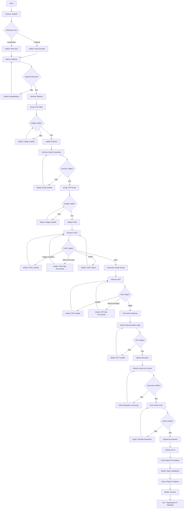

# MARKETPLACE DE CESSÃO DE CRÉDITO CONSIGNADO - (UC-001)

**Versão:** 1.2.0  
**Data de Criação:** 03/02/2026  
**Última Atualização:** 04/02/2026  

---

## 1. Identificação e Resumo

| Campo | Valor |
|-------|-------|
| **ID/Nome** | UC-001 Habilitar Participante no Marketplace |
| **Prioridade** | Alta |
| **Versão** | 1.2.0 |
| **Status** | Implementado |
| **Ator Primário** | Instituição Financeira (Cedente ou Cessionário) |
| **Ator Secundário** | Administrador Marketplace (BackOffice) |
| **Descrição** | Permitir que uma instituição financeira se cadastre na plataforma CreditFlow como Cedente, Cessionário ou ambos, passando por validação de captcha, OTP (telefone e email), dados cadastrais, dados do representante legal, dados bancários, dados de acesso e upload de documentos, com análise automática por IA e validações em órgãos reguladores. |

---

## 2. Contexto de Negócio e Engenharia

### Pré-condições
- Usuário possui acesso à internet e navegador compatível
- Usuário possui CNPJ ativo na Receita Federal
- Usuário possui email corporativo (domínios genéricos bloqueados)
- Usuário possui telefone celular válido para recebimento de OTP
- Usuário possui documentos obrigatórios digitalizados (PDF, PNG, JPG)

### Pós-condições (Sucesso)
- Instituição cadastrada no sistema com status "Aguardando 2ª Validação"
- Dados validados junto à Brasil API (CNPJ) e ViaCEP (Endereço)
- Documentos submetidos e analisados por IA (1ª validação automática)
- Validações CNPJ e BACEN com status "OK"
- Email de confirmação enviado ao usuário
- Registro disponível para revisão manual pelo BackOffice

### Pós-condições (Falha)
- Log de erro gerado no sistema
- Modal de erro exibido ao usuário com orientação de correção
- Cadastro não finalizado até correção dos dados inválidos

---

## 3. Fluxo Principal (Caminho Feliz)

### Estrutura de Passos do Cadastro

| Passo | Nome do Passo | Campos/Ações |
|-------|---------------|--------------|
| 1 | Validar Telefone | Captcha + Telefone + OTP SMS |
| 2 | Validar E-mail | Email corporativo + OTP Email |
| 3 | Dados Cadastrais | CNPJ, Razão Social, CEP, Endereço |
| 4 | Dados Representante | Nome, CPF, RG, Cargo, Departamento |
| 5 | Dados Bancários | Banco, Agência, Conta, Observações |
| 6 | Dados de Acesso | Nome de Usuário, Senha, Confirmar Senha, Frase-Chave |
| 7 | Documentos | Upload dos 3 documentos obrigatórios |

### Etapas Detalhadas do Cadastro

| Passo | Ação | Validação | Resultado |
|-------|------|-----------|-----------|
| 1.1 | Usuário acessa `/register` e seleciona tipo: Cedente ou Cessionário | - | Tema visual aplicado (dourado para Cedente, azul para Cessionário) |
| 1.2 | Usuário clica no captcha "Não sou um robô" | Captcha deve estar marcado | Captcha validado, botões habilitados |
| 1.3 | Usuário informa telefone celular | Formato: (00) 00000-0000 | Sistema envia código OTP por SMS |
| 1.4 | Usuário informa código OTP de 6 dígitos | Código deve ser `123456` (demo) | Telefone validado com sucesso |
| 2.1 | Usuário informa email corporativo | Bloqueia: gmail, hotmail, yahoo, outlook, live | Sistema envia código OTP por email |
| 2.2 | Usuário informa código OTP de 6 dígitos | Código deve ser `123456` (demo) | Email validado com sucesso |
| 3.1 | Usuário informa CNPJ | Formato: 00.000.000/0000-00, dígitos verificadores válidos | Sistema consulta Brasil API |
| 3.2 | Sistema preenche automaticamente Razão Social | CNPJ deve estar ATIVO na Receita Federal | Campo bloqueado com indicador verde |
| 3.3 | Usuário informa CEP | Formato: 00000-000 | Sistema consulta ViaCEP |
| 3.4 | Sistema preenche automaticamente Endereço, Cidade, Estado | CEP deve existir na base dos Correios | Campos bloqueados para edição |
| 4.1 | Usuário informa dados do Representante Legal | CPF válido com dígitos verificadores | Dados salvos |
| 5.1 | Usuário informa dados bancários | Banco, Agência, Conta | Dados salvos |
| 6.1 | Usuário informa nome de usuário | Mínimo 4 caracteres, apenas letras minúsculas, números e underscore | Username validado |
| 6.2 | Usuário cria senha forte | Mínimo 18 caracteres, maiúscula, minúscula, número, especial | Senha validada |
| 6.3 | Usuário confirma senha | Senhas devem coincidir | Confirmação validada |
| 6.4 | Usuário informa frase-chave | Frase secreta para geração de chave de criptografia | Frase-chave salva |
| 7.1 | Usuário faz upload dos documentos obrigatórios | Contrato Social, Comprovante de Endereço, Documento do Representante | Análise por IA iniciada |
| 7.2 | Sistema exibe progresso de upload e análise por IA | - | Indicador de progresso e conclusão |
| 7.3 | Usuário clica em "Status Pré Análises" | - | Modal com tabela de validações exibido |
| 7.4 | Sistema exibe status: CNPJ OK, BACEN OK, Documentos Pendente 2ª Validação | - | Usuário clica OK |
| 7.5 | Usuário clica em "Finalizar Cadastro" | - | Modal de sucesso exibido |
| 7.6 | Sistema exibe mensagem de sucesso e próximos passos | - | Usuário redirecionado para login |

---

## 4. Fluxos Alternativos e de Exceção

### FA00 – Captcha Não Marcado
- **Trigger:** Usuário tenta enviar OTP ou continuar sem marcar o captcha
- **Ação:** Botão "Enviar" e "Continuar" ficam desabilitados
- **Comportamento:** O captcha deve ser marcado antes de qualquer ação
- **Retorno:** Usuário deve clicar no captcha para prosseguir

### FA01 – Código OTP Incorreto (Telefone)
- **Trigger:** Usuário informa código diferente de `123456` no passo 1.4
- **Ação:** Sistema exibe modal "Código Inválido"
- **Mensagem:** "O código informado não corresponde ao código enviado para seu telefone"
- **Retorno:** Usuário pode tentar novamente ou solicitar reenvio

### FA02 – Código OTP Incorreto (Email)
- **Trigger:** Usuário informa código diferente de `123456` no passo 2.2
- **Ação:** Sistema exibe modal "Código Inválido"
- **Mensagem:** "O código informado não corresponde ao código enviado para seu email"
- **Retorno:** Usuário pode tentar novamente ou solicitar reenvio

### FA03 – Email com Domínio Genérico
- **Trigger:** Usuário informa email com domínio bloqueado no passo 2.1
- **Ação:** Sistema exibe modal "Email Inválido"
- **Mensagem:** "Por favor, utilize um email corporativo"
- **Domínios bloqueados:** gmail.com, hotmail.com, yahoo.com, yahoo.com.br, outlook.com, live.com, uol.com.br, bol.com.br, terra.com.br, ig.com.br, globo.com, r7.com, icloud.com, aol.com, protonmail.com, zoho.com, mail.com, yandex.com, gmx.com
- **Retorno:** Passo 2.1 para correção

### FE01 – CNPJ com Dígitos Verificadores Inválidos
- **Trigger:** CNPJ informado não passa na validação de dígitos verificadores
- **Ação:** Sistema exibe modal "CNPJ Inválido"
- **Mensagem:** "O CNPJ informado possui dígitos verificadores inválidos"
- **Retorno:** Passo 3.1 para correção

### FE02 – CNPJ Não Encontrado na Receita Federal
- **Trigger:** CNPJ não existe na base da Brasil API
- **Ação:** Sistema exibe modal "CNPJ Não Encontrado"
- **Mensagem:** "CNPJ não encontrado na base de dados da Receita Federal"
- **Retorno:** Passo 3.1 para correção

### FE03 – CNPJ com Situação Inativa
- **Trigger:** CNPJ encontrado, mas situação diferente de "ATIVA"
- **Ação:** Sistema exibe modal "CNPJ Inativo"
- **Mensagem:** "O CNPJ informado não está com situação ATIVA na Receita Federal"
- **Exibe:** Situação atual do CNPJ (ex: BAIXADA, SUSPENSA, INAPTA)
- **Retorno:** Passo 3.1 para correção

### FE04 – CEP Inválido ou Incompleto
- **Trigger:** CEP com menos de 8 dígitos
- **Ação:** Sistema exibe modal "CEP Inválido"
- **Mensagem:** "O CEP informado está incompleto ou possui formato inválido"
- **Retorno:** Passo 3.3 para correção

### FE05 – CEP Não Encontrado
- **Trigger:** CEP não existe na base ViaCEP
- **Ação:** Sistema exibe modal "CEP Não Encontrado"
- **Mensagem:** "CEP não encontrado na base de dados dos Correios"
- **Retorno:** Passo 3.3 para correção

### FE06 – CPF com Dígitos Verificadores Inválidos
- **Trigger:** CPF do representante não passa na validação
- **Ação:** Sistema exibe modal "CPF Inválido"
- **Mensagem:** "O CPF informado possui dígitos verificadores inválidos"
- **Retorno:** Passo 4.1 para correção

### FE07 – Nome de Usuário Inválido
- **Trigger:** Nome de usuário não atende aos requisitos
- **Validação:**
  - Mínimo 4 caracteres
  - Apenas letras minúsculas (a-z)
  - Números (0-9)
  - Underscore (_)
- **Ação:** Validação em tempo real com feedback visual
- **Retorno:** Passo 6.1 para correção

### FE08 – Senha Fraca
- **Trigger:** Senha não atende aos requisitos mínimos
- **Validação exibida em tempo real:**
  - Mínimo 18 caracteres
  - Pelo menos uma letra maiúscula (A-Z)
  - Pelo menos uma letra minúscula (a-z)
  - Pelo menos um número (0-9)
  - Pelo menos um caractere especial (!@#$%^&*()_+-=[]{}|;:,.<>?)
- **Caracteres proibidos:** ç, ã, á, é, í, ó, ú, â, ê, ô, à, Ç, Ã, Á, É, Í, Ó, Ú, Â, Ê, Ô, À
- **Retorno:** Passo 6.2 para correção

### FE09 – Senhas Não Coincidem
- **Trigger:** Campo "Confirmar Senha" diferente do campo "Senha"
- **Ação:** Validação em tempo real com indicador visual vermelho
- **Mensagem:** "As senhas não coincidem"
- **Retorno:** Passo 6.3 para correção

---

## 5. Regras de Negócio (RN)

### RN01 – Captcha Obrigatório
- O captcha "Não sou um robô" deve ser marcado antes de enviar OTP
- Botões de envio e continuação ficam desabilitados até marcação do captcha
- Implementação visual com checkbox estilizado e ícone de escudo

### RN02 – Tipo de Usuário Define Tema Visual
- **Cedente:** Cor primária dourada (#D4AF37)
- **Cessionário:** Cor primária azul (#3b82f6)
- O tema é aplicado em todos os botões, indicadores e elementos de destaque

### RN03 – Validação de CNPJ via API Externa
- Consulta obrigatória à Brasil API (`brasilapi.com.br/api/cnpj/v1/`)
- Apenas CNPJ com situação "ATIVA" é aceito
- Razão Social é preenchida automaticamente e bloqueada para edição
- Indicador visual verde quando auto-preenchido

### RN04 – Validação de CEP via API Externa
- Consulta obrigatória à ViaCEP (`viacep.com.br/ws/`)
- Campos Endereço, Cidade e Estado são preenchidos automaticamente e bloqueados

### RN05 – Email Corporativo Obrigatório
- Domínios genéricos são bloqueados para garantir legitimidade da instituição
- Lista de bloqueio expandida com 19 domínios populares

### RN06 – Nome de Usuário
- Mínimo 4 caracteres
- Apenas letras minúsculas, números e underscore permitidos
- Formatação automática para minúsculas
- Caracteres inválidos são removidos automaticamente

### RN07 – Senha Forte Obrigatória
- Mínimo 18 caracteres
- Deve conter: maiúscula, minúscula, número e caractere especial
- Não pode conter caracteres especiais portugueses (acentos, cedilha)
- Barra de força da senha exibida em tempo real
- Checklist de requisitos com indicadores visuais (verde/cinza)

### RN08 – Gerador Automático de Senha
- Botão "Gerar" disponível para criar senha forte automaticamente
- Senha gerada com 20 caracteres atendendo todos os requisitos
- Preenche automaticamente os campos Senha e Confirmar Senha

### RN08.1 – Frase-Chave de Criptografia
- Campo obrigatório no passo 6 (Dados de Acesso)
- Será utilizada como chave na geração da criptografia dos dados sensíveis
- Ícone de informação (ℹ️) exibe tooltip explicativo ao passar o mouse
- Usuário deve guardar a frase-chave em local seguro
- A frase-chave é armazenada de forma segura no banco de dados

### RN09 – Documentos Obrigatórios para Cadastro
- Contrato Social (PDF, PNG ou JPG, até 10MB)
- Comprovante de Endereço (PDF, PNG ou JPG, até 10MB)
- Documento do Representante Legal (PDF, PNG ou JPG, até 10MB)
- Upload via explorador de arquivos nativo do sistema operacional

### RN10 – Análise Documental em Duas Etapas
- **1ª Etapa (Automática):** Análise por IA durante upload com barra de progresso
- **2ª Etapa (Manual):** Revisão pelo BackOffice em até 48h úteis

### RN11 – Validações Regulatórias
- CNPJ validado junto à Receita Federal
- BACEN consultado para verificação de pendências
- Status exibido no modal de pré-análise

### RN12 – Botão de Finalização em Dois Estados
- **Estado 1:** "Status Pré Análises" (laranja) - Exibe modal com tabela de validações
- **Estado 2:** "Finalizar Cadastro" (verde) - Aparece após visualizar pré-análises

### RN13 – Credenciais de Demonstração
- Código OTP de teste: `123456`
- Usuário Cedente: `cedente1` / Senha: `123456`
- Usuário Cessionário: `cessionario1` / Senha: `123456`

---

## 6. Requisitos Não Funcionais (RNF)

### RNF01 – Performance
- Resposta do sistema ao upload de documentos não deve ultrapassar 120 segundos
- Consultas à Brasil API e ViaCEP devem ter timeout de 10 segundos
- Indicador de carregamento obrigatório durante operações assíncronas

### RNF02 – Segurança
- Captcha obrigatório antes de envio de OTP
- Autenticação OTP obrigatória para telefone e email
- Senha com requisitos mínimos de complexidade (18 caracteres)
- Dados sensíveis não são exibidos em logs
- Sessão expira após inatividade

### RNF03 – Usabilidade
- Formatação automática de campos (CNPJ, CPF, CEP, Telefone)
- Validação em tempo real com feedback visual
- Modais de erro com mensagens claras e orientação de correção
- Indicadores visuais de campos preenchidos automaticamente
- Checklist interativo de requisitos de senha
- Explorador de arquivos nativo para upload de documentos

### RNF04 – Compatibilidade
- Suporte a navegadores modernos (Chrome, Firefox, Safari, Edge)
- Layout responsivo para desktop e tablets
- Fonte padrão: Inter (Google Fonts)

### RNF05 – LGPD
- Dados sensíveis devem ser mascarados em logs
- Consentimento explícito via aceite de termos
- Opção de exclusão de dados mediante solicitação

---

## 7. Protótipos e Documentação de Apoio

### Telas do Fluxo de Cadastro

| Passo | Tela | URL |
|-------|------|-----|
| 1 | Validar Telefone (Captcha + OTP) | `/register?step=1` |
| 2 | Validar E-mail (OTP) | `/register?step=2` |
| 3 | Dados Cadastrais | `/register?step=3` |
| 4 | Dados do Representante Legal | `/register?step=4` |
| 5 | Dados Bancários | `/register?step=5` |
| 6 | Dados de Acesso | `/register?step=6` |
| 7 | Upload de Documentos | `/register?step=7` |

### Cores e Tema Visual

| Elemento | Cor | Hex |
|----------|-----|-----|
| Fundo Principal | Dark Blue | #0d1117 |
| Fundo de Cards | Dark Gray | #161b22 |
| Bordas | Gray | #30363d |
| Texto Primário | White | #ffffff |
| Texto Secundário | Gray | #8b949e |
| Cedente (Primário) | Gold | #D4AF37 |
| Cessionário (Primário) | Blue | #3b82f6 |
| Sucesso | Green | #22c55e |
| Alerta/Pendente | Orange | #f97316 |
| Erro | Red | #ef4444 |

---

## 8. Fluxo do Processo (Diagrama BPMN)

---

## 9. Diagrama de Sequência (UML)

```mermaid
%%{init: {'theme': 'base', 'themeVariables': { 'background': '#ffffff', 'primaryColor': '#e3f2fd', 'primaryTextColor': '#1a1a1a', 'primaryBorderColor': '#1976d2', 'lineColor': '#424242', 'secondaryColor': '#f5f5f5', 'tertiaryColor': '#fafafa', 'noteBkgColor': '#fff9c4', 'noteTextColor': '#1a1a1a', 'noteBorderColor': '#fbc02d', 'actorBkg': '#e3f2fd', 'actorBorder': '#1976d2', 'actorTextColor': '#1a1a1a', 'actorLineColor': '#424242', 'signalColor': '#424242', 'signalTextColor': '#1a1a1a', 'labelBoxBkgColor': '#e3f2fd', 'labelBoxBorderColor': '#1976d2', 'labelTextColor': '#1a1a1a', 'loopTextColor': '#1a1a1a', 'activationBorderColor': '#1976d2', 'activationBkgColor': '#bbdefb', 'sequenceNumberColor': '#ffffff'}}}%%
sequenceDiagram
    participant U as Usuário
    participant S as Sistema CreditFlow
    participant SMS as Serviço SMS
    participant EMAIL as Serviço Email
    participant BRASIL as Brasil API
    participant CEP as ViaCEP
    participant IA as Motor de IA
    participant BO as BackOffice

    U->>S: Acessar /register
    U->>S: Selecionar tipo (Cedente/Cessionário)
    S-->>U: Aplicar tema visual
    
    rect rgb(227, 242, 253)
        Note over U,S: Validação Captcha
        U->>S: Marcar captcha "Não sou um robô"
        S-->>U: Habilitar botões de envio
    end
    
    rect rgb(232, 245, 233)
        Note over U,SMS: Verificação de Telefone (Passo 1)
        U->>S: Informar telefone
        S->>SMS: Enviar código OTP
        SMS-->>U: SMS com código
        U->>S: Informar código OTP (6 dígitos)
        alt Código inválido
            S-->>U: Modal "Código Inválido"
        else Código válido
            S-->>U: Telefone validado
        end
    end
    
    rect rgb(243, 229, 245)
        Note over U,EMAIL: Verificação de Email (Passo 2)
        U->>S: Informar email corporativo
        alt Domínio bloqueado
            S-->>U: Modal "Email Inválido"
        else Domínio válido
            S->>EMAIL: Enviar código OTP
            EMAIL-->>U: Email com código
            U->>S: Informar código OTP (6 dígitos)
            alt Código inválido
                S-->>U: Modal "Código Inválido"
            else Código válido
                S-->>U: Email validado
            end
        end
    end
    
    rect rgb(255, 243, 224)
        Note over U,BRASIL: Dados Cadastrais (Passo 3)
        U->>S: Informar CNPJ
        S->>BRASIL: Consultar CNPJ
        alt CNPJ inválido/não encontrado/inativo
            BRASIL-->>S: Erro
            S-->>U: Modal de erro correspondente
        else CNPJ ativo
            BRASIL-->>S: Dados da empresa
            S-->>U: Preencher Razão Social (readonly + indicador verde)
        end
        
        U->>S: Informar CEP
        S->>CEP: Consultar CEP
        alt CEP inválido/não encontrado
            CEP-->>S: Erro
            S-->>U: Modal de erro correspondente
        else CEP válido
            CEP-->>S: Dados de endereço
            S-->>U: Preencher Endereço, Cidade, Estado (readonly)
        end
    end
    
    rect rgb(224, 247, 250)
        Note over U,S: Dados do Representante (Passo 4)
        U->>S: Informar nome, CPF, RG, cargo, departamento
        alt CPF inválido
            S-->>U: Modal "CPF Inválido"
        else CPF válido
            S-->>U: Dados salvos
        end
    end
    
    rect rgb(237, 231, 246)
        Note over U,S: Dados Bancários (Passo 5)
        U->>S: Informar banco, agência, conta
        S-->>U: Dados bancários salvos
    end
    
    rect rgb(255, 235, 238)
        Note over U,S: Dados de Acesso (Passo 6)
        U->>S: Informar nome de usuário
        alt Username inválido
            S-->>U: Exibir requisitos (min 4 chars, lowercase, números, underscore)
        else Username válido
            S-->>U: Username aceito
        end
        U->>S: Criar senha forte (ou clicar Gerar)
        alt Senha fraca
            S-->>U: Exibir checklist de requisitos não atendidos
        else Senha válida
            S-->>U: Senha aceita (barra verde)
        end
        U->>S: Confirmar senha
        alt Senhas não coincidem
            S-->>U: Mensagem "As senhas não coincidem"
        else Senhas coincidem
            S-->>U: Confirmação aceita
        end
        U->>S: Informar frase-chave de criptografia
        S-->>U: Frase-chave salva (será usada para gerar chave de criptografia)
    end
    
    rect rgb(232, 245, 233)
        Note over U,IA: Upload de Documentos (Passo 7)
        U->>S: Clicar área de upload (abre file explorer)
        U->>S: Selecionar arquivo do sistema
        S->>S: Iniciar upload com barra de progresso
        S->>IA: Enviar documento para análise
        IA-->>S: Primeira análise documental por IA
        S-->>U: Documento analisado (indicador verde)
    end
    
    rect rgb(255, 249, 196)
        Note over U,BO: Finalização
        U->>S: Clicar "Status Pré Análises" (botão laranja)
        S-->>U: Modal com tabela de validações (CNPJ OK, BACEN OK, Docs Pendente)
        U->>S: Clicar OK
        S-->>U: Trocar botão para "Finalizar Cadastro" (verde)
        U->>S: Clicar "Finalizar Cadastro"
        S-->>U: Modal de sucesso com próximos passos
        S->>BO: Cadastro disponível para 2ª validação
        S->>EMAIL: Enviar confirmação ao usuário
    end
```

---

## 10. Links Externos Usados para Validação de Dados

| Serviço | URL | Finalidade |
|---------|-----|------------|
| Brasil API | `https://brasilapi.com.br/api/cnpj/v1/{cnpj}` | Consulta de CNPJ e Razão Social |
| ViaCEP | `https://viacep.com.br/ws/{cep}/json/` | Consulta de CEP e Endereço |

---

## 11. Histórico de Versões

| Versão | Data | Autor | Alterações |
|--------|------|-------|------------|
| 1.0.0 | 03/02/2026 | VibeCode | Criação do documento com fluxo completo de cadastro |
| 1.1.0 | 04/02/2026 | VibeCode | Adicionado captcha no passo 1; Separado passo 6 (Dados de Acesso) do passo 5 (Dados Bancários); Adicionado campo Nome de Usuário; Atualizado fluxo para 7 passos; Atualizado diagrama de sequência com fundo branco; Expandida lista de domínios bloqueados |
| 1.2.0 | 04/02/2026 | VibeCode | Adicionado campo Frase-Chave no passo 6 para geração de chave de criptografia; Adicionada regra RN08.1 sobre frase-chave; Atualizado diagrama de sequência; Implementada persistência no banco de dados |

---

## 12. Aprovações

| Papel | Nome | Data | Assinatura |
|-------|------|------|------------|
| Product Owner | - | - | Pendente |
| Tech Lead | - | - | Pendente |
| QA Lead | - | - | Pendente |

---

*Documento gerado automaticamente pelo sistema CreditFlow - VibeCode*
