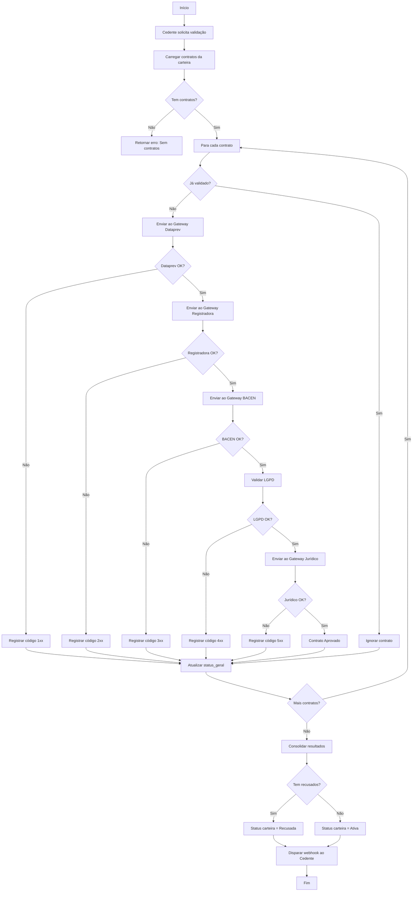
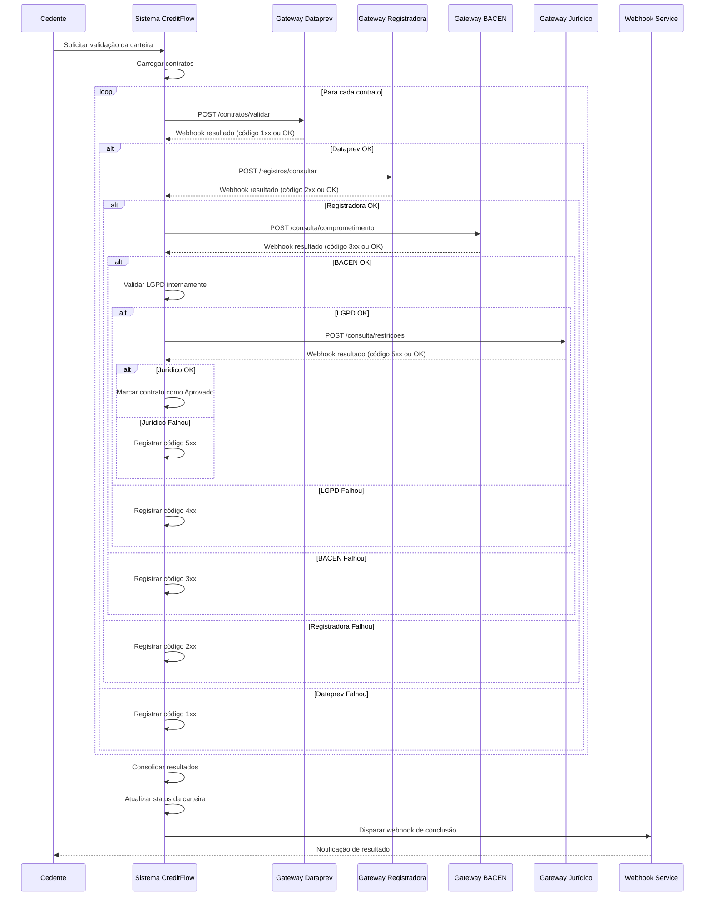

# MARKETPLACE DE CESSÃO DE CRÉDITO CONSIGNADO - (UC-002)

**Versão:** 1.0.0  
**Data de Criação:** 05/02/2026  
**Última Atualização:** 05/02/2026  

---

## 1. Identificação e Resumo

| Campo | Valor |
|-------|-------|
| **ID/Nome** | UC-002 Validar Elegibilidade Regulatória da Carteira |
| **Prioridade** | Alta |
| **Versão** | 1.0.0 |
| **Status** | Implementado |
| **Ator Primário** | Cedente (Instituição Financeira) |
| **Ator Secundário** | Motor de Validação, Gateways Externos |
| **Descrição** | Verificar a conformidade regulatória de uma carteira de crédito consignado através da validação automática de cada contrato junto às entidades reguladoras e bases de dados oficiais (Dataprev, Registradora, BACEN, LGPD, Jurídico), determinando quais contratos estão elegíveis para cessão no marketplace. |

---

## 2. Contexto de Negócio e Engenharia

### Pré-condições
- Carteira de crédito já criada no ambiente Sandbox ou Produção
- Carteira contendo pelo menos um contrato de crédito consignado
- Cedente autenticado no sistema com permissões adequadas
- Contratos com dados mínimos obrigatórios preenchidos (beneficiário, valores, prazos)
- Conexão ativa com os gateways das entidades reguladoras

### Pós-condições (Sucesso)
- Todos os contratos validados com status "Aprovado" ou "Recusado"
- Códigos de erro registrados no campo `status_geral` dos contratos recusados
- Motivos de recusa detalhados no campo `motivo_recusa`
- Status da carteira atualizado para "Ativa" (se todos aprovados) ou "Recusada" (se houver recusas)
- Webhook de notificação disparado para o Cedente
- Log de auditoria gerado com todas as validações realizadas

### Pós-condições (Falha)
- Falha de comunicação com gateway registrada no log
- Contrato marcado como "Pendente de Validação"
- Webhook de erro disparado para o Cedente
- Retry automático agendado para próxima janela de processamento

---

## 3. Fluxo Principal (Caminho Feliz)

### Estrutura do Processo de Validação

| Etapa | Entidade | Gateway | Validações Realizadas |
|-------|----------|---------|----------------------|
| 1 | Dataprev | Gateway INSS/Dataprev | Contratos, benefícios, margem, bloqueios |
| 2 | Registradora | Gateway CIP/Registradora | Cessões prévias, gravames, titularidade |
| 3 | BACEN | Gateway SCR/BACEN | Comprometimento de renda, prazo, portabilidade |
| 4 | LGPD | Motor Interno | Base legal, consentimento, dados |
| 5 | Jurídico | Gateway Judicial | Restrições jurídicas, administrativas, regulatórias |

### Etapas Detalhadas

| Passo | Ação | Validação | Resultado |
|-------|------|-----------|-----------|
| 1.1 | Cedente solicita validação da carteira | Carteira deve existir e ter contratos | Processo de validação iniciado |
| 1.2 | Sistema carrega todos os contratos da carteira | - | Lista de contratos recuperada |
| 1.3 | Sistema verifica se contrato já foi validado | Campo `status_geral` não pode ter código de erro | Contratos já processados são ignorados |
| 2.1 | Requisição enviada ao Gateway Dataprev | Timeout de 30 segundos | Webhook recebido com resposta |
| 2.2 | Validação de existência do contrato | Contrato deve existir na base Dataprev | Código 101 se não encontrado |
| 2.3 | Validação de status do benefício | Benefício deve estar ativo/vigente/regular | Código 102 se inativo |
| 2.4 | Validação de margem consignável | Margem disponível deve ser > 0 | Código 103 se esgotada |
| 2.5 | Validação de bloqueios judiciais | Benefício não pode ter bloqueio ativo | Código 104 se bloqueado |
| 3.1 | Requisição enviada ao Gateway Registradora | Timeout de 30 segundos | Webhook recebido com resposta |
| 3.2 | Validação de cessão prévia | Contrato não pode ter cessão registrada há mais de 5 anos | Código 201 se existe |
| 3.3 | Validação de gravame | Valor contratado não pode exceder R$ 100.000 | Código 202 se gravame ativo |
| 3.4 | Validação de titularidade | Cedente deve constar como titular | Código 203 se conflito |
| 4.1 | Requisição enviada ao Gateway BACEN | Timeout de 30 segundos | Webhook recebido com resposta |
| 4.2 | Validação de comprometimento de renda | Percentual não pode exceder 35% | Código 301 se excede |
| 4.3 | Validação de prazo do contrato | Total de parcelas não pode exceder 84 meses | Código 302 se excede |
| 4.4 | Validação de taxa de juros | Taxa mensal não pode exceder 2,14% (consignado INSS) | Código 303 se excede |
| 5.1 | Validação LGPD pelo motor interno | - | Base legal e consentimento verificados |
| 5.2 | Requisição enviada ao Gateway Jurídico | Timeout de 30 segundos | Webhook recebido com resposta |
| 5.3 | Validação de restrições jurídicas | Status não pode ser irregular/suspenso/bloqueado | Código 501 se restrição |
| 5.4 | Validação de prazo regulatório | Contrato não pode exceder 7 anos desde contratação | Código 503 se excede |
| 6.1 | Sistema consolida todos os resultados | - | Status final definido |
| 6.2 | Contratos recusados são atualizados | Código de erro + motivo registrados | Banco de dados atualizado |
| 6.3 | Status da carteira é atualizado | Se houver recusa, carteira fica "Recusada" | Carteira reflete status consolidado |
| 6.4 | Webhook de conclusão disparado ao Cedente | - | Cedente notificado do resultado |

---

## 4. Fluxos Alternativos e de Exceção

### FA01 – Contrato Já Validado Anteriormente
- **Trigger:** Campo `status_geral` já contém código de erro
- **Ação:** Contrato é ignorado no processamento atual
- **Comportamento:** Mantém status anterior
- **Retorno:** Contrato listado como "Já Processado" no resultado

### FA02 – Timeout no Gateway Dataprev
- **Trigger:** Gateway não responde em 30 segundos
- **Ação:** Contrato marcado como "Pendente - Dataprev"
- **Webhook:** Erro enviado ao Cedente com previsão de retry
- **Retorno:** Retry automático em 15 minutos

### FA03 – Timeout no Gateway Registradora
- **Trigger:** Gateway não responde em 30 segundos
- **Ação:** Contrato marcado como "Pendente - Registradora"
- **Webhook:** Erro enviado ao Cedente com previsão de retry
- **Retorno:** Retry automático em 15 minutos

### FA04 – Timeout no Gateway BACEN
- **Trigger:** Gateway não responde em 30 segundos
- **Ação:** Contrato marcado como "Pendente - BACEN"
- **Webhook:** Erro enviado ao Cedente com previsão de retry
- **Retorno:** Retry automático em 15 minutos

### FA05 – Carteira Sem Contratos
- **Trigger:** Carteira não possui nenhum contrato vinculado
- **Ação:** Processo abortado com erro
- **Webhook:** Erro enviado ao Cedente
- **Retorno:** Mensagem "Nenhum contrato encontrado"

### FE01 – Múltiplos Códigos de Erro no Mesmo Contrato
- **Trigger:** Contrato falha em múltiplas validações
- **Ação:** Primeiro código de erro é registrado como principal
- **Comportamento:** Todos os motivos são concatenados no campo `motivo_recusa`
- **Retorno:** Status final "Recusado" com detalhamento completo

---

## 5. Regras de Negócio (RN)

### RN01 – Validação Dataprev
- Gateway Dataprev é consultado via HTTPS com certificado digital
- Contrato deve existir na base de dados do INSS
- Benefício deve estar com situação "ATIVO" ou equivalente
- Margem consignável deve estar disponível (valor > 0)
- Benefícios com pensão alimentícia ou bloqueio judicial são rejeitados

### RN02 – Validação Registradora
- Gateway Registradora (CIP) verifica registro de cessões e gravames
- Contratos com cessão prévia há mais de 5 anos são rejeitados
- Gravames ativos em contratos acima de R$ 100.000 são bloqueados
- Titularidade do cedente deve estar confirmada

### RN03 – Limites Regulatórios BACEN
- Comprometimento máximo de renda: 35% do benefício
- Prazo máximo do contrato: 84 meses (7 anos)
- Taxa de juros máxima para consignado INSS: 2,14% ao mês
- Essas regras seguem a Instrução Normativa INSS/PRES nº 28

### RN04 – Conformidade LGPD
- Tratamento de dados deve ter base legal válida
- Consentimento do beneficiário deve estar registrado
- Dados coletados devem ser apenas os necessários para a operação
- Log de acesso aos dados pessoais deve ser mantido

### RN05 – Validação Jurídica
- Contratos com status irregular, suspenso ou bloqueado são rejeitados
- Restrições administrativas impedem cessão
- Prazo regulatório máximo para cessão: 7 anos desde a contratação

### RN06 – Prioridade de Códigos de Erro
- Quando múltiplas falhas ocorrem, o primeiro código detectado é o principal
- Ordem de prioridade: Dataprev (1xx) > Registradora (2xx) > BACEN (3xx) > LGPD (4xx) > Jurídico (5xx)

### RN07 – Atualização de Status da Carteira
- Se qualquer contrato for recusado, a carteira recebe status "Recusada"
- Apenas carteiras com 100% de contratos aprovados ficam "Ativas"
- Carteiras com contratos pendentes de validação ficam "Aguardando Validação"

---

## 6. Códigos de Erro por Entidade

### Dataprev (100-199)

| Código | Descrição | Ação Recomendada |
|--------|-----------|------------------|
| 101 | Contrato não encontrado na base Dataprev | Verificar dados do contrato |
| 102 | Benefício não está ativo ou regular | Aguardar regularização |
| 103 | Margem consignável indisponível ou esgotada | Não elegível para cessão |
| 104 | Benefício possui bloqueio judicial ativo | Não elegível para cessão |

### Registradora (200-299)

| Código | Descrição | Ação Recomendada |
|--------|-----------|------------------|
| 201 | Contrato possui cessão prévia registrada | Não elegível (já cedido) |
| 202 | Contrato possui gravame ativo registrado | Regularizar gravame |
| 203 | Conflito de titularidade detectado | Verificar documentação |

### BACEN (300-399)

| Código | Descrição | Ação Recomendada |
|--------|-----------|------------------|
| 301 | Comprometimento de renda excede 35% | Não elegível |
| 302 | Prazo do contrato excede 84 meses | Não elegível |
| 303 | Taxa de juros acima do teto permitido | Não elegível |

### LGPD (400-499)

| Código | Descrição | Ação Recomendada |
|--------|-----------|------------------|
| 401 | Base legal para tratamento não identificada | Obter consentimento |
| 402 | Consentimento do titular não registrado | Obter consentimento |
| 403 | Coleta de dados excessiva identificada | Revisar dados coletados |

### Jurídico (500-599)

| Código | Descrição | Ação Recomendada |
|--------|-----------|------------------|
| 501 | Contrato possui restrição jurídica ativa | Não elegível |
| 502 | Restrição administrativa identificada | Regularizar pendências |
| 503 | Contrato excede prazo regulatório (7 anos) | Não elegível |

---

## 7. Requisitos Não Funcionais (RNF)

### RNF01 – Performance
- Tempo máximo de resposta por contrato: 30 segundos por gateway
- Processamento em lote para carteiras com mais de 100 contratos
- Execução em horários de baixa demanda (06h, 12h, 18h) para lotes grandes

### RNF02 – Disponibilidade de Gateways
- Retry automático em caso de falha de comunicação
- Máximo de 3 tentativas por gateway
- Intervalo entre retries: 15 minutos

### RNF03 – Segurança
- Comunicação com gateways via HTTPS com TLS 1.3
- Certificados digitais ICP-Brasil para autenticação
- Tokens de acesso com validade de 1 hora
- Logs de auditoria imutáveis

### RNF04 – Rastreabilidade
- Cada validação gera registro único com timestamp
- Correlação de requisições via ID único da carteira
- Logs mantidos por 5 anos conforme regulamentação

### RNF05 – Webhooks
- Notificações em tempo real para o Cedente
- Formato JSON padronizado
- Retry automático em caso de falha de entrega
- Assinatura HMAC para autenticidade

---

## 8. Integrações via Gateway

### Gateway Dataprev (INSS)
| Atributo | Valor |
|----------|-------|
| Protocolo | HTTPS REST |
| Autenticação | Certificado Digital ICP-Brasil |
| Endpoint Base | `https://gateway.dataprev.gov.br/api/v1` |
| Operação | POST /contratos/validar |
| Webhook Retorno | POST /webhook/dataprev/resultado |

### Gateway Registradora (CIP)
| Atributo | Valor |
|----------|-------|
| Protocolo | HTTPS REST |
| Autenticação | OAuth 2.0 + Certificado |
| Endpoint Base | `https://gateway.cip.org.br/api/v2` |
| Operação | POST /registros/consultar |
| Webhook Retorno | POST /webhook/registradora/resultado |

### Gateway BACEN (SCR)
| Atributo | Valor |
|----------|-------|
| Protocolo | HTTPS REST |
| Autenticação | Certificado Digital BACEN |
| Endpoint Base | `https://gateway.bcb.gov.br/scr/v1` |
| Operação | POST /consulta/comprometimento |
| Webhook Retorno | POST /webhook/bacen/resultado |

### Gateway Jurídico
| Atributo | Valor |
|----------|-------|
| Protocolo | HTTPS REST |
| Autenticação | API Key + Certificado |
| Endpoint Base | `https://gateway.tribunais.jus.br/api/v1` |
| Operação | POST /consulta/restricoes |
| Webhook Retorno | POST /webhook/juridico/resultado |

---

## 9. Fluxo do Processo (Diagrama BPMN)

---

## 10. Diagrama de Sequência (UML)

---

## 11. Histórico de Versões

| Versão | Data | Autor | Alterações |
|--------|------|-------|------------|
| 1.0.0 | 05/02/2026 | CreditFlow | Criação do documento de validação regulatória |

---

## 12. Aprovações

| Papel | Nome | Data | Assinatura |
|-------|------|------|------------|
| Product Owner | - | - | Pendente |
| Tech Lead | - | - | Pendente |
| Compliance Officer | - | - | Pendente |
| QA Lead | - | - | Pendente |

---

*Documento gerado automaticamente pelo sistema CreditFlow*  
*Confidencial - Uso interno*
