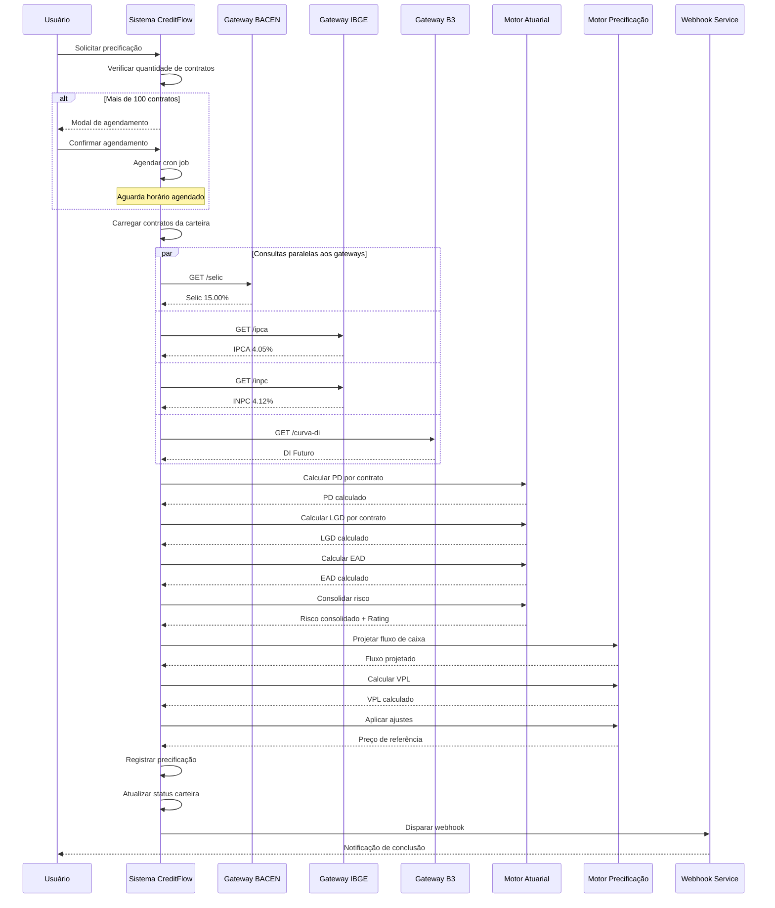

# MARKETPLACE DE CESSÃO DE CRÉDITO CONSIGNADO - (UC-003)

**Versão:** 1.0.0  
**Data de Criação:** 05/02/2026  
**Última Atualização:** 05/02/2026  

---

## 1. Identificação e Resumo

| Campo | Valor |
|-------|-------|
| **ID/Nome** | UC-003 Calcular Score de Risco e Precificação da Carteira |
| **Prioridade** | Alta |
| **Versão** | 1.0.0 |
| **Status** | Implementado |
| **Ator Primário** | Cessionário (Investidor) ou Cedente |
| **Ator Secundário** | Motor de Precificação, Gateways de Dados Macroeconômicos |
| **Descrição** | Calcular o score de risco, rating de crédito e preço justo de uma carteira de crédito consignado através de modelos atuariais que incorporam dados históricos, variáveis macroeconômicas e modelos de risco (PD, LGD, EAD), determinando o Valor Presente Líquido (VPL) projetado e o preço de referência para negociação no marketplace. |

---

## 2. Contexto de Negócio e Engenharia

### Pré-condições
- Carteira de crédito validada e elegível (UC-002 aprovado)
- Carteira contendo pelo menos um contrato de crédito consignado
- Usuário autenticado no sistema (Cedente ou Cessionário)
- Acesso ativo aos gateways de dados macroeconômicos
- Contratos com dados financeiros completos (valores, prazos, taxas)

### Pós-condições (Sucesso)
- Rating de crédito calculado (AAA a CCC)
- Valor Presente Líquido (VPL) projetado
- Preço de referência definido para negociação
- Spread mínimo calculado
- Registro versionado da precificação no banco de dados
- Status da carteira atualizado para "Precificada"
- Webhook de conclusão disparado ao solicitante

### Pós-condições (Falha)
- Falha de comunicação com gateway macroeconômico registrada
- Precificação marcada como "Pendente"
- Webhook de erro disparado ao solicitante
- Retry agendado para próxima janela de processamento

---

## 3. Fluxo Principal (Caminho Feliz)

### Processo de Precificação em 16 Etapas

| Etapa | Descrição | Fonte de Dados |
|-------|-----------|----------------|
| 1 | Consolidar dados históricos dos contratos | Base interna |
| 2 | Consultar taxa de inadimplência histórica | Gateway histórico |
| 3 | Consultar taxa de refinanciamento histórico | Gateway histórico |
| 4 | Consultar taxa de cancelamento histórico | Gateway histórico |
| 5 | Consultar incidência de eventos judiciais | Gateway jurídico |
| 6 | Consultar taxa Selic vigente | Gateway BACEN |
| 7 | Consultar IPCA acumulado 12 meses | Gateway IBGE |
| 8 | Consultar INPC acumulado 12 meses | Gateway IBGE |
| 9 | Obter curva de juros futuros | Gateway B3 |
| 10 | Aplicar modelo PD (Probability of Default) | Motor atuarial |
| 11 | Aplicar modelo LGD (Loss Given Default) | Motor atuarial |
| 12 | Aplicar modelo EAD (Exposure at Default) | Motor atuarial |
| 13 | Calcular risco consolidado da carteira | Motor atuarial |
| 14 | Determinar rating de crédito | Motor de rating |
| 15 | Calcular VPL projetado com fluxo de caixa | Motor financeiro |
| 16 | Aplicar ajustes e determinar preço de referência | Motor de precificação |

### Etapas Detalhadas

| Passo | Ação | Validação | Resultado |
|-------|------|-----------|-----------|
| 1.1 | Usuário solicita precificação da carteira | Carteira deve estar validada | Processo iniciado |
| 1.2 | Sistema verifica quantidade de contratos | Se > 100, requer processamento em lote | Modo de processamento definido |
| 2.1 | Consultar dados históricos de inadimplência | Gateway histórico responde | Taxa média: 3.5% |
| 2.2 | Consultar dados de refinanciamento | Gateway histórico responde | Taxa média: 8.2% |
| 2.3 | Consultar dados de cancelamento | Gateway histórico responde | Taxa média: 2.1% |
| 2.4 | Consultar eventos judiciais | Gateway jurídico responde | Incidência: 1.5% |
| 3.1 | Requisição ao Gateway BACEN para Selic | Timeout de 10 segundos | Selic: 15.00% a.a. |
| 3.2 | Requisição ao Gateway IBGE para IPCA | Timeout de 10 segundos | IPCA 12m: 4.05% |
| 3.3 | Requisição ao Gateway IBGE para INPC | Timeout de 10 segundos | INPC 12m: 4.12% |
| 3.4 | Requisição ao Gateway B3 para curva de juros | Timeout de 10 segundos | DI Futuro obtido |
| 4.1 | Calcular PD (Probability of Default) | Modelo atuarial aplicado | PD por contrato |
| 4.2 | Calcular LGD (Loss Given Default) | Modelo atuarial aplicado | LGD por contrato |
| 4.3 | Calcular EAD (Exposure at Default) | Modelo atuarial aplicado | EAD da carteira |
| 5.1 | Consolidar risco individual por contrato | PD × LGD | Risco por contrato |
| 5.2 | Calcular risco consolidado da carteira | Fator de exposição + concentração | Risco total |
| 6.1 | Determinar rating de crédito | Baseado no risco consolidado | Rating AAA a CCC |
| 7.1 | Projetar fluxo de caixa futuro | Parcelas vincendas consideradas | Fluxo mensal |
| 7.2 | Aplicar taxa de desconto ajustada | Selic + spread de risco | Taxa de desconto |
| 7.3 | Calcular VPL projetado | Fórmula de valor presente | VPL em R$ |
| 8.1 | Aplicar ajuste de risco sistêmico | Cenário macroeconômico | Desconto aplicado |
| 8.2 | Aplicar ajuste de liquidez | Tamanho e perfil da carteira | Desconto aplicado |
| 8.3 | Aplicar ajuste de concentração | Diversificação de benefícios | Desconto aplicado |
| 9.1 | Calcular spread mínimo | Cobertura de riscos | Spread definido |
| 9.2 | Determinar preço de referência | VPL - ajustes | Preço final |
| 10.1 | Registrar precificação versionada | Todos os dados consolidados | Registro salvo |
| 10.2 | Atualizar status da carteira | - | Status = "Precificada" |
| 10.3 | Disparar webhook ao solicitante | - | Notificação enviada |

---

## 4. Modelos de Risco

### 4.1 Modelo PD (Probability of Default)

O modelo de Probabilidade de Default estima a chance de um beneficiário não honrar suas obrigações.

**Fórmula Base:**
```
PD = PD_base × (1 + fator_tipo_beneficio) × (1 + fator_prazo)
```

**Fatores por Tipo de Benefício:**

| Tipo de Benefício | Fator de Ajuste | Justificativa |
|-------------------|-----------------|---------------|
| Aposentadoria por idade | -5% | Renda estável, baixo risco |
| Aposentadoria por tempo | -3% | Renda estável |
| Pensão por morte | +2% | Risco de cessação |
| BPC/LOAS | +5% | Benefício assistencial, maior risco |
| Auxílio-doença | +10% | Benefício temporário |
| Servidores públicos | -8% | Estabilidade funcional |
| Militares | -10% | Alta estabilidade |
| Trabalhadores CLT | +15% | Risco de desemprego |

**Fator de Prazo:**
```
fator_prazo = 0.001 × parcelas_restantes
```

### 4.2 Modelo LGD (Loss Given Default)

O modelo de Perda Dado o Default estima o percentual de perda em caso de inadimplência.

**Fórmula Base:**
```
LGD = LGD_base × (1 + fator_recuperacao)
```

**Taxas de Recuperação por Tipo:**

| Tipo de Consignado | LGD Base | Taxa de Recuperação |
|--------------------|----------|---------------------|
| INSS | 35% | 65% |
| Servidores Públicos | 30% | 70% |
| Militares | 25% | 75% |
| Trabalhadores CLT | 45% | 55% |

### 4.3 Modelo EAD (Exposure at Default)

O modelo de Exposição no Default considera o saldo devedor ajustado por pré-pagamentos esperados.

**Fórmula:**
```
EAD = Saldo_Devedor × (1 - taxa_prepagamento_esperada)
```

**Taxa de Pré-pagamento por Prazo:**

| Prazo Restante | Taxa de Pré-pagamento |
|----------------|----------------------|
| < 12 meses | 5% |
| 12-36 meses | 15% |
| 36-60 meses | 20% |
| > 60 meses | 25% |

### 4.4 Fator EAD no Risco

O EAD impacta o rating de forma proporcional ao volume de exposição:

| Faixa de EAD | Fator de Ajuste | Impacto |
|--------------|-----------------|---------|
| > R$ 1.000.000 | 1.15 | Aumenta risco em 15% |
| R$ 500.000 - R$ 1.000.000 | 1.08 | Aumenta risco em 8% |
| R$ 100.000 - R$ 500.000 | 1.00 | Neutro |
| < R$ 100.000 | 0.92 | Reduz risco em 8% |

---

## 5. Cálculo do Rating de Crédito

### 5.1 Fórmula de Risco Consolidado

```
Risco_Consolidado = (PD × LGD) × Fator_Exposição × Fator_Concentração × Fator_EAD
```

Onde:
- **Fator_Exposição** = EAD / Saldo_Devedor
- **Fator_Concentração** = 1 + (índice_concentração × 0.1)
- **Fator_EAD** = Ajuste baseado no volume de exposição

### 5.2 Escala de Rating

| Rating | Risco Consolidado | Descrição | Spread Mínimo |
|--------|-------------------|-----------|---------------|
| AAA | < 1% | Risco muito baixo | 1.0% |
| AA | 1% - 2% | Risco baixo | 1.5% |
| A | 2% - 3% | Risco moderado-baixo | 2.0% |
| BBB | 3% - 5% | Risco moderado | 2.5% |
| BB | 5% - 8% | Risco moderado-alto | 3.5% |
| B | 8% - 12% | Risco alto | 4.5% |
| CCC | > 12% | Risco muito alto | 6.0% |

---

## 6. Cálculo do VPL e Preço de Referência

### 6.1 Projeção do Fluxo de Caixa

Para cada contrato:
```
Fluxo_Mensal[i] = Valor_Parcela × (1 - PD_ajustado)
```

### 6.2 Taxa de Desconto

```
Taxa_Desconto = Selic + Spread_Rating + Prêmio_Risco
```

Onde:
- **Selic**: Taxa básica de juros vigente
- **Spread_Rating**: Spread mínimo conforme rating
- **Prêmio_Risco**: Ajuste adicional por características específicas

### 6.3 Cálculo do VPL

```
VPL = Σ [Fluxo_Mensal[i] / (1 + Taxa_Desconto/12)^i]
```

Para i de 1 até o número de parcelas vincendas.

### 6.4 Ajustes ao Preço de Referência

| Ajuste | Fórmula | Impacto Típico |
|--------|---------|----------------|
| Risco Sistêmico | VPL × 2% | Redução de 2% |
| Liquidez | VPL × 1.5% | Redução de 1.5% |
| Concentração | VPL × (concentração × 0.5%) | Variável |

### 6.5 Preço Final

```
Preço_Referência = VPL × (1 - Ajuste_Sistêmico - Ajuste_Liquidez - Ajuste_Concentração)
```

---

## 7. Regras de Negócio (RN)

### RN01 – Carteiras com Mais de 100 Contratos
- Precificação deve ser executada em lote via cron job
- Horários permitidos: 06h, 12h, 18h (fora do horário de pico)
- Usuário recebe notificação para agendar processamento
- Webhook disparado ao término do processamento

### RN02 – Dados Macroeconômicos
- Taxa Selic consultada diariamente no Gateway BACEN
- IPCA e INPC consultados mensalmente no Gateway IBGE
- Curva de juros futuros atualizada diariamente via Gateway B3
- Cache de 24 horas para dados macroeconômicos

### RN03 – Versionamento de Precificação
- Cada precificação gera registro único com timestamp
- Histórico mantido para auditoria e análise de tendências
- Versão mais recente é a válida para negociação

### RN04 – Spread Mínimo por Rating
- Spread mínimo é definido conforme escala de rating
- Não é permitido negociar abaixo do spread mínimo
- Spread máximo não tem limite (mercado livre)

### RN05 – Atualização de Status
- Carteira precificada fica disponível no marketplace
- Status "Precificada" habilita botões de compra/venda
- Precificação válida por 24 horas (renovação automática)

### RN06 – Ajuste de Concentração
- Índice de concentração baseado no tipo de benefício predominante
- Carteiras diversificadas recebem menor penalidade
- Concentração > 80% em um tipo aplica penalidade máxima

---

## 8. Dados Macroeconômicos Utilizados

### Valores de Referência (Fevereiro/2026)

| Indicador | Valor | Fonte | Atualização |
|-----------|-------|-------|-------------|
| Taxa Selic | 15.00% a.a. | Gateway BACEN | Diária |
| IPCA 12 meses | 4.05% | Gateway IBGE | Mensal |
| INPC 12 meses | 4.12% | Gateway IBGE | Mensal |
| DI Futuro 1 ano | 14.85% | Gateway B3 | Diária |
| DI Futuro 2 anos | 14.50% | Gateway B3 | Diária |

---

## 9. Fluxos Alternativos e de Exceção

### FA01 – Carteira com Mais de 100 Títulos
- **Trigger:** Quantidade de contratos > 100
- **Ação:** Modal informativo exibido ao usuário
- **Comportamento:** Usuário agenda processamento em lote
- **Retorno:** Webhook disparado ao término

### FA02 – Timeout no Gateway BACEN
- **Trigger:** Gateway não responde em 10 segundos
- **Ação:** Utilizar última taxa Selic em cache
- **Comportamento:** Precificação continua com dado em cache
- **Retorno:** Flag de "dados aproximados" no resultado

### FA03 – Timeout no Gateway IBGE
- **Trigger:** Gateway não responde em 10 segundos
- **Ação:** Utilizar último IPCA/INPC em cache
- **Comportamento:** Precificação continua com dado em cache
- **Retorno:** Flag de "dados aproximados" no resultado

### FA04 – Carteira Sem Contratos Válidos
- **Trigger:** Todos os contratos foram recusados
- **Ação:** Precificação não pode ser executada
- **Comportamento:** Erro retornado ao usuário
- **Retorno:** Mensagem "Carteira sem contratos elegíveis"

---

## 10. Requisitos Não Funcionais (RNF)

### RNF01 – Performance
- Precificação de carteira com até 100 contratos: máximo 30 segundos
- Precificação em lote: processamento em background via cron
- Cache de dados macroeconômicos para otimizar consultas

### RNF02 – Precisão
- Cálculos financeiros com precisão de 8 casas decimais
- Arredondamento final para 2 casas decimais (R$)
- Validação cruzada de resultados

### RNF03 – Rastreabilidade
- Cada precificação gera ID único
- Todos os parâmetros de entrada registrados
- Auditoria completa do cálculo disponível

### RNF04 – Segurança
- Comunicação com gateways via HTTPS
- Dados de precificação criptografados em repouso
- Acesso restrito por perfil de usuário

---

## 11. Integrações via Gateway

### Gateway BACEN (Taxa Selic)
| Atributo | Valor |
|----------|-------|
| Protocolo | HTTPS REST |
| Endpoint | `https://api.bcb.gov.br/dados/serie/bcdata.sgs.432/dados` |
| Autenticação | API Key |
| Cache | 24 horas |

### Gateway IBGE (IPCA/INPC)
| Atributo | Valor |
|----------|-------|
| Protocolo | HTTPS REST |
| Endpoint IPCA | `https://servicodados.ibge.gov.br/api/v3/agregados/7060` |
| Endpoint INPC | `https://servicodados.ibge.gov.br/api/v3/agregados/7063` |
| Autenticação | Público |
| Cache | 30 dias |

### Gateway B3 (Curva de Juros)
| Atributo | Valor |
|----------|-------|
| Protocolo | HTTPS REST |
| Endpoint | `https://cotacao.b3.com.br/mds/api/v1/DI` |
| Autenticação | API Key |
| Cache | 24 horas |

---

## 12. Fluxo do Processo (Diagrama BPMN)

```mermaid
flowchart TD
    A[Início] --> B[Usuário solicita precificação]
    B --> C{Qtd contratos > 100?}
    C -->|Sim| D[Exibir modal de agendamento]
    D --> E[Agendar cron job]
    E --> F[Aguardar execução]
    F --> G[Webhook: Início processamento]
    C -->|Não| H[Iniciar precificação imediata]
    G --> H
    
    H --> I[Carregar dados dos contratos]
    I --> J[Consultar Gateway Histórico]
    J --> K[Consultar Gateway BACEN - Selic]
    K --> L[Consultar Gateway IBGE - IPCA/INPC]
    L --> M[Consultar Gateway B3 - Curva DI]
    
    M --> N[Calcular PD por contrato]
    N --> O[Calcular LGD por contrato]
    O --> P[Calcular EAD da carteira]
    
    P --> Q[Consolidar risco da carteira]
    Q --> R[Determinar Rating]
    
    R --> S[Projetar fluxo de caixa]
    S --> T[Calcular VPL]
    
    T --> U[Aplicar ajuste risco sistêmico]
    U --> V[Aplicar ajuste liquidez]
    V --> W[Aplicar ajuste concentração]
    
    W --> X[Calcular spread mínimo]
    X --> Y[Determinar preço de referência]
    
    Y --> Z[Registrar precificação]
    Z --> AA[Atualizar status carteira]
    AA --> AB[Disparar webhook conclusão]
    AB --> AC[Fim]
```



---

## 13. Diagrama de Sequência (UML)



---

## 14. Resultado da Precificação (Exemplo)

```json
{
  "carteira_id": "CART-2026-001",
  "data_precificacao": "2026-02-05T14:30:00Z",
  "versao": 1,
  "rating": "AA",
  "indicadores_risco": {
    "pd_medio": "2.85%",
    "lgd_medio": "35.00%",
    "ead_total": "R$ 2.450.000,00",
    "risco_consolidado": "1.42%"
  },
  "valores": {
    "vpl_projetado": "R$ 2.850.000,00",
    "preco_referencia": "R$ 2.736.000,00",
    "preco_por_titulo": "R$ 27.360,00",
    "spread_minimo": "1.5%"
  },
  "ajustes_aplicados": {
    "risco_sistemico": "-2.0%",
    "liquidez": "-1.5%",
    "concentracao": "-0.5%"
  },
  "dados_macroeconomicos": {
    "selic": "15.00%",
    "ipca_12m": "4.05%",
    "inpc_12m": "4.12%"
  },
  "status": "Precificada"
}
```

---

## 15. Histórico de Versões

| Versão | Data | Autor | Alterações |
|--------|------|-------|------------|
| 1.0.0 | 05/02/2026 | CreditFlow | Criação do documento de precificação |

---

## 16. Aprovações

| Papel | Nome | Data | Assinatura |
|-------|------|------|------------|
| Product Owner | - | - | Pendente |
| Tech Lead | - | - | Pendente |
| Risk Manager | - | - | Pendente |
| QA Lead | - | - | Pendente |

---

*Documento gerado automaticamente pelo sistema CreditFlow*  
*Confidencial - Uso interno*
