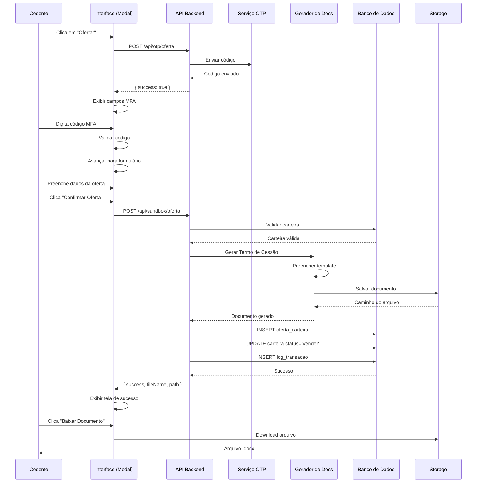
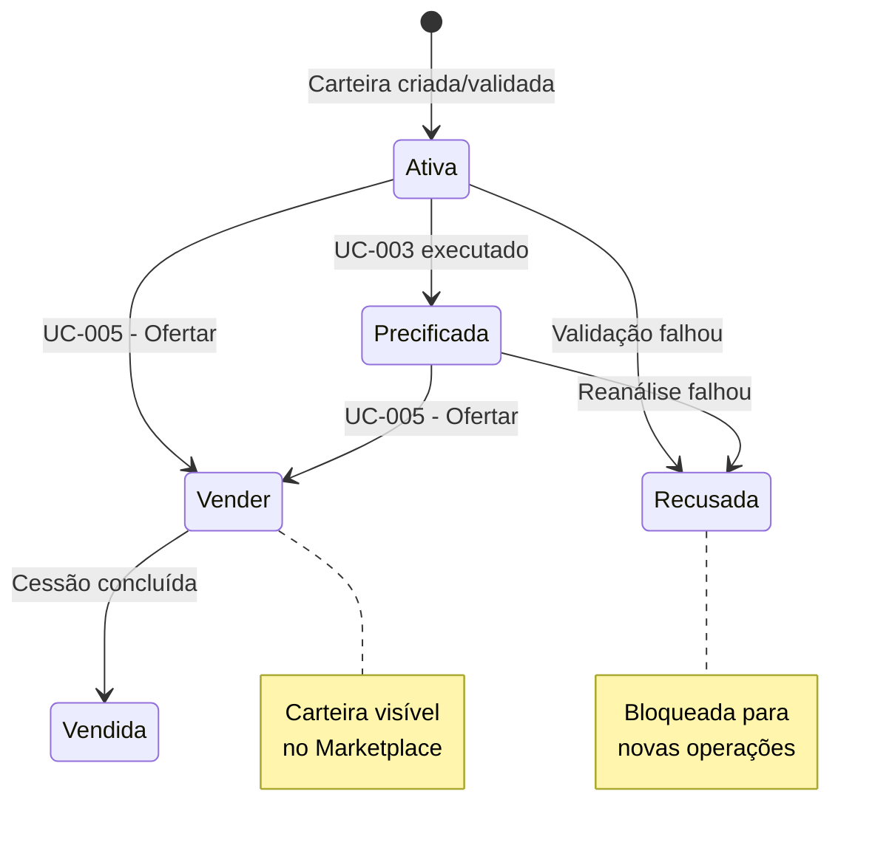

# MARKETPLACE DE CESSÃO DE CRÉDITO CONSIGNADO - (UC-005)

**Versão:** 1.0.0  
**Data de Criação:** 05/02/2026  
**Última Atualização:** 05/02/2026  

---

## 1. Identificação e Resumo

| Campo | Valor |
|-------|-------|
| **ID/Nome** | UC-005 Publicar Oferta de Cessão |
| **Prioridade** | Alta |
| **Versão** | 1.0.0 |
| **Status** | Em Definição |
| **Ator Primário** | Instituição Financeira Cedente |
| **Ator Secundário** | Sistema de Validação de Crédito, Administrador da Plataforma |
| **Descrição** | Disponibilizar a carteira no marketplace para consulta dos cessionários. O Cedente realiza a publicação de uma nova oferta de cessão de direitos (recebíveis ou ativos) para que potenciais Cessionários (investidores/instituições) possam visualizar e adquirir. O processo inicia no botão "Ofertar" e segue até a geração do Termo de Cessão de Crédito, momento em que a carteira fica publicada no marketplace e disponível para venda. |

---

## 2. Contexto de Negócio e Engenharia

### Pré-condições
- Usuário autenticado no sistema como Cedente
- Carteira de crédito com status "Ativa" (não pode ser "Recusada" ou "Vender")
- Carteira validada e elegível (UC-002 aprovado)
- Carteira precificada (UC-003 executado com sucesso) - Recomendado
- E-mail e telefone do cedente cadastrados para envio de OTP

### Pós-condições (Sucesso)
- Código MFA validado com sucesso
- Oferta registrada na tabela `oferta_carteira`
- Documento Word (Termo de Cessão de Crédito) gerado e armazenado
- Status da carteira atualizado para "Vender"
- Carteira visível no marketplace para todos os cessionários
- Log de transação registrado na tabela `log_transacao`
- Webhook de conclusão disparado (opcional)

### Pós-condições (Falha)
- Código MFA inválido - Usuário impedido de prosseguir
- Erro na geração do documento - Oferta marcada como "Pendente"
- Falha de comunicação - Retry disponível
- Carteira permanece com status anterior

---

## 3. Fluxo Principal (Caminho Feliz)

### Processo de Publicação de Oferta em 4 Etapas

| Etapa | Nome | Descrição |
|-------|------|-----------|
| 1 | Verificação MFA | Validação de identidade via código OTP de 6 dígitos |
| 2 | Formulário da Oferta | Preenchimento dos dados da oferta |
| 3 | Processamento | Validação, geração de documento e registro |
| 4 | Confirmação de Sucesso | Exibição do resultado e download do documento |

### Etapas Detalhadas

| Passo | Ação | Validação | Resultado |
|-------|------|-----------|-----------|
| 1.1 | Cedente clica no botão "Ofertar" na carteira | Carteira deve ter status "Ativa" | Modal de oferta é aberto |
| 1.2 | Sistema envia código OTP via API | E-mail/telefone válidos | Código de 6 dígitos enviado |
| 1.3 | Cedente digita o código MFA | Código deve ter 6 dígitos numéricos | Campos preenchidos automaticamente avançam |
| 1.4 | Sistema valida o código | Código deve corresponder ao enviado | Avanço para próxima etapa |
| 2.1 | Sistema preenche valor nominal automaticamente | Baseado no valor da carteira | Campo pré-populado |
| 2.2 | Cedente informa percentual de deságio | Valor numérico obrigatório | Deságio registrado |
| 2.3 | Cedente informa data de vencimento | Data futura obrigatória | Data validada |
| 2.4 | Cedente seleciona tipo de ativo | Lista pré-definida | Tipo selecionado |
| 2.5 | Cedente pode anexar documentos adicionais | Formatos permitidos: PDF, DOC, DOCX | Arquivos anexados (opcional) |
| 3.1 | Cedente clica em "Confirmar Oferta" | Todos campos obrigatórios preenchidos | Processamento iniciado |
| 3.2 | Sistema valida dados da oferta | Regras de negócio | Dados validados |
| 3.3 | Sistema gera Termo de Cessão de Crédito | Template Word preenchido | Documento .docx criado |
| 3.4 | Sistema salva documento no storage | Diretório baseado em ambiente | Arquivo persistido |
| 3.5 | Sistema registra oferta no banco | Tabela oferta_carteira | Registro criado |
| 3.6 | Sistema atualiza status da carteira | Status → "Vender" | Carteira atualizada |
| 3.7 | Sistema registra log de transação | Tabela log_transacao | Auditoria registrada |
| 4.1 | Sistema exibe tela de sucesso | - | Confirmação visual |
| 4.2 | Sistema disponibiliza download do documento | Link para .docx | Download disponível |
| 4.3 | Carteira aparece no marketplace | Status "Vender" | Visível para cessionários |

---

## 4. Interface do Usuário - Fluxo Visual

### 4.1 Etapa 1: Verificação MFA

**Elementos da Tela:**
- Título: "Verificação de Segurança"
- Ícone de cadeado/segurança
- Texto explicativo: "Um código de verificação foi enviado para seu e-mail/telefone"
- 6 campos de input numérico para o código OTP
- Indicador de carregamento durante envio
- Botão "Reenviar código" (após timeout)
- Mensagem de erro se código inválido

**Comportamento:**
- Foco automático no primeiro campo
- Avanço automático ao digitar cada dígito
- Backspace retorna ao campo anterior
- Validação automática quando 6 dígitos inseridos

### 4.2 Etapa 2: Formulário da Oferta

**Campos do Formulário:**

| Campo | Tipo | Obrigatório | Descrição |
|-------|------|-------------|-----------|
| Valor Nominal | Currency | Sim | Pré-preenchido com valor da carteira |
| Deságio (%) | Número | Sim | Percentual de desconto oferecido |
| Data de Vencimento | Date | Sim | Data limite para cessão |
| Tipo de Ativo | Select | Sim | Tipo do crédito (Consignado INSS, etc.) |
| Documentos Adicionais | File Upload | Não | Anexos complementares |

**Botões:**
- "Cancelar" - Fecha modal sem salvar
- "Confirmar Oferta" - Avança para processamento

### 4.3 Etapa 3: Processamento

**Elementos da Tela:**
- Barra de progresso animada (0-100%)
- Lista de etapas sendo executadas:
  - Validando dados da oferta
  - Gerando Termo de Cessão de Crédito
  - Registrando oferta no sistema
  - Atualizando status da carteira
- Spinner de carregamento
- Mensagem de aguarde

### 4.4 Etapa 4: Confirmação de Sucesso

**Elementos da Tela:**
- Ícone de sucesso (check verde)
- Título: "Oferta Publicada com Sucesso!"
- Informações da oferta realizada
- Botão "Baixar Termo de Cessão" (download do .docx)
- Botão "Fechar" - Retorna ao marketplace
- Mensagem: "Sua carteira está agora disponível para venda no marketplace"

---

## 5. Documento Gerado: Termo de Cessão de Crédito

### 5.1 Estrutura do Documento Word

O sistema gera automaticamente um documento .docx contendo:

**Cabeçalho:**
- Logo CreditFlow (placeholder)
- Título: "TERMO DE CESSÃO DE DIREITOS CREDITÓRIOS"
- Identificador do ambiente (SANDBOX ou PRODUÇÃO)
- Data e hora de geração

**Seção 1 - Identificação das Partes:**
- Dados do Cedente (razão social, CNPJ, endereço, representante)
- Espaço para dados do Cessionário (preenchimento posterior)

**Seção 2 - Dados da Carteira:**
- ID da carteira
- Nome da carteira
- Quantidade de títulos
- Valor nominal total
- Tipo de ativo predominante
- Prazo médio remanescente

**Seção 3 - Condições da Cessão:**
- Valor nominal da cessão
- Percentual de deságio
- Valor líquido da cessão
- Data de vencimento
- Condições de pagamento

**Seção 4 - Amostra dos Títulos:**
- Tabela com os primeiros 50 contratos (se houver)
- Colunas: ID Título, Beneficiário, CPF, Valor, Parcelas, Status

**Seção 5 - Disposições Gerais:**
- Cláusulas padrão de cessão
- Responsabilidades das partes
- Foro de eleição

**Rodapé:**
- Espaço para assinaturas
- Data de geração
- Marca d'água do ambiente (Sandbox/Produção)

### 5.2 Armazenamento

| Ambiente | Diretório |
|----------|-----------|
| Sandbox | `storage/documentos/sandbox/` |
| Produção | `storage/documentos/producao/` |

**Nomenclatura do arquivo:**
`termo_cessao_{carteiraId}_{timestamp}.docx`

---

## 6. Regras de Negócio (RN)

### RN01 – Elegibilidade para Ofertar
- Apenas carteiras com status "Ativa" podem ser ofertadas
- Carteiras com status "Recusada" estão bloqueadas
- Carteiras já ofertadas (status "Vender") mostram botão "Em Oferta"

### RN02 – Validação MFA Obrigatória
- Código OTP de 6 dígitos é obrigatório
- Código válido por 5 minutos
- Máximo de 3 tentativas
- Após 3 falhas, usuário deve aguardar 15 minutos

### RN03 – Campos Obrigatórios
- Valor nominal (pré-preenchido)
- Percentual de deságio (0-100%)
- Data de vencimento (futura)
- Tipo de ativo

### RN04 – Deságio
- Deve ser um valor numérico entre 0 e 100
- Representa o percentual de desconto sobre o valor nominal
- Valor líquido = Valor Nominal × (1 - Deságio/100)

### RN05 – Geração de Documento
- Documento gerado em formato Microsoft Word (.docx)
- Template padrão com dados preenchidos automaticamente
- Inclui até 50 títulos da carteira como amostra
- Ambiente claramente identificado (Sandbox/Produção)

### RN06 – Atualização de Status
- Após sucesso, status da carteira muda para "Vender"
- Carteira fica visível no marketplace público
- Botão "Ofertar" muda para "Em Oferta" (desabilitado)

### RN07 – Log de Transação
- Toda oferta gera registro de auditoria
- Campos registrados: username, carteira_id, operação, ambiente, timestamp
- Logs consultáveis no Audit Place

---

## 7. Fluxos Alternativos e de Exceção

### FA01 – Código MFA Inválido
- **Trigger:** Usuário digita código incorreto
- **Ação:** Exibir mensagem de erro
- **Comportamento:** Limpar campos e permitir nova tentativa
- **Retorno:** Usuário permanece na etapa MFA

### FA02 – Código MFA Expirado
- **Trigger:** Usuário demora mais de 5 minutos
- **Ação:** Exibir mensagem de expiração
- **Comportamento:** Oferecer reenvio de novo código
- **Retorno:** Novo código enviado

### FA03 – Campos Obrigatórios Não Preenchidos
- **Trigger:** Usuário tenta confirmar sem preencher campos
- **Ação:** Exibir mensagem de validação
- **Comportamento:** Destacar campos faltantes
- **Retorno:** Usuário corrige e resubmete

### FA04 – Erro na Geração do Documento
- **Trigger:** Falha ao criar arquivo .docx
- **Ação:** Registrar erro e notificar usuário
- **Comportamento:** Oferta marcada como "Pendente"
- **Retorno:** Retry disponível

### FA05 – Carteira Já Ofertada
- **Trigger:** Tentativa de ofertar carteira com status "Vender"
- **Ação:** Botão "Ofertar" aparece como "Em Oferta" (desabilitado)
- **Comportamento:** Usuário não consegue clicar
- **Retorno:** Nenhuma ação possível

### FA06 – Cancelamento pelo Usuário
- **Trigger:** Usuário clica em "Cancelar" ou fecha modal
- **Ação:** Descartar dados não salvos
- **Comportamento:** Retornar ao marketplace
- **Retorno:** Nenhuma alteração no sistema

---

## 8. Integrações e APIs

### 8.1 API de Envio de OTP
```
POST /api/otp/oferta
Request: { username, carteiraId }
Response: { success: boolean, message: string }
```

### 8.2 API de Submissão de Oferta
```
POST /api/sandbox/oferta (ou /api/producao/oferta)
Request: {
  carteiraId: string,
  username: string,
  valorNominal: number,
  desagio: number,
  dataVencimento: string,
  tipoAtivo: string,
  documentos: string,
  mfaCode: string
}
Response: {
  success: boolean,
  fileName: string,
  termoCessaoPath: string,
  error?: string
}
```

### 8.3 Estrutura de Dados

**Tabela: oferta_carteira**

| Coluna | Tipo | Descrição |
|--------|------|-----------|
| id | SERIAL | Chave primária |
| carteira_id | INTEGER | FK para carteira_agregada |
| username | VARCHAR(50) | Usuário que criou a oferta |
| valor_nominal | DECIMAL(15,2) | Valor nominal da cessão |
| desagio | DECIMAL(5,2) | Percentual de deságio |
| data_vencimento | DATE | Data limite para cessão |
| tipo_ativo | VARCHAR(100) | Tipo do ativo cedido |
| termo_cessao_path | VARCHAR(500) | Caminho do documento gerado |
| status | VARCHAR(50) | Status da oferta |
| ambiente | VARCHAR(20) | sandbox ou producao |
| created_at | TIMESTAMP | Data de criação |

---

## 9. Requisitos Não Funcionais (RNF)

### RNF01 – Performance
- Envio de OTP: máximo 3 segundos
- Geração de documento: máximo 10 segundos
- Atualização de status: máximo 2 segundos

### RNF02 – Segurança
- OTP obrigatório para toda oferta
- Código expira em 5 minutos
- Comunicação via HTTPS
- Documentos armazenados com permissões restritas

### RNF03 – Usabilidade
- Interface responsiva
- Feedback visual em todas as etapas
- Mensagens de erro claras
- Possibilidade de cancelar a qualquer momento

### RNF04 – Rastreabilidade
- Todas as ações registradas em log
- Documentos versionados com timestamp
- Auditoria completa disponível

---

## 10. Diagrama de Sequência (UML)



---

## 11. Fluxo de Estados da Carteira



---

## 12. Indicadores do Dashboard

Após implementação do UC-005, o dashboard exibe:

| Indicador | Descrição | Status Considerado |
|-----------|-----------|-------------------|
| Carteiras Ofertar | Carteiras elegíveis para oferta | Status = "Ativa" |
| Carteiras a Venda | Carteiras publicadas no marketplace | Status = "Vender" |
| Total Disponível | Valor total em carteiras disponíveis | Status = "Vender" |

---

## 13. Considerações de Implementação

### 13.1 Ambiente Sandbox vs Produção

| Aspecto | Sandbox | Produção |
|---------|---------|----------|
| Diretório de Docs | `storage/documentos/sandbox/` | `storage/documentos/producao/` |
| API Endpoint | `/api/sandbox/oferta` | `/api/producao/oferta` |
| Marca d'água | "DOCUMENTO DE TESTE - SANDBOX" | Sem marca d'água |
| Cor do Tema | Amarelo (#D4AF37) | Verde (#22c55e) |
| Validação MFA | Aceita código "123456" para testes | Validação real obrigatória |

### 13.2 Bibliotecas Utilizadas
- **docx**: Geração de documentos Word
- **next/server**: API Routes do Next.js
- **PostgreSQL**: Banco de dados

---

## 14. Histórico de Versões

| Versão | Data | Autor | Alterações |
|--------|------|-------|------------|
| 1.0.0 | 05/02/2026 | CreditFlow | Criação do documento |

---

## 15. Aprovações

| Papel | Nome | Data | Assinatura |
|-------|------|------|------------|
| Product Owner | - | - | Pendente |
| Tech Lead | - | - | Pendente |
| Compliance | - | - | Pendente |
| QA Lead | - | - | Pendente |

---

*Documento gerado automaticamente pelo sistema CreditFlow*  
*Confidencial - Uso interno*
