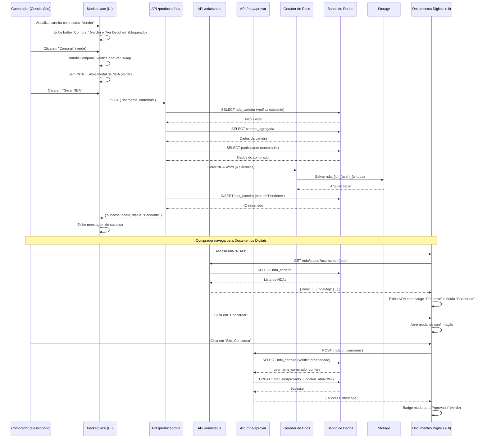
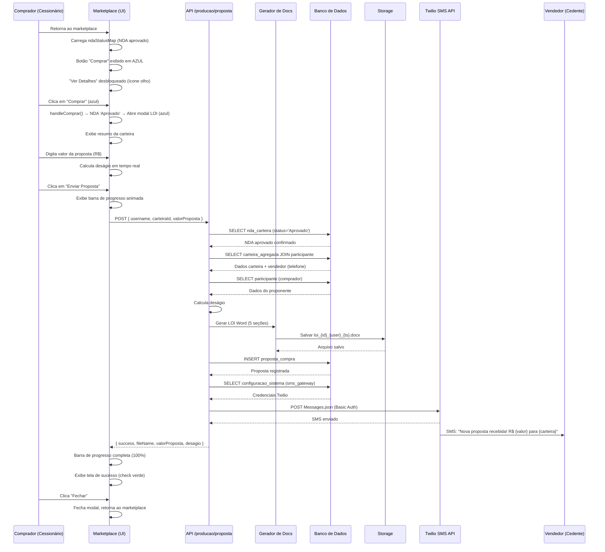
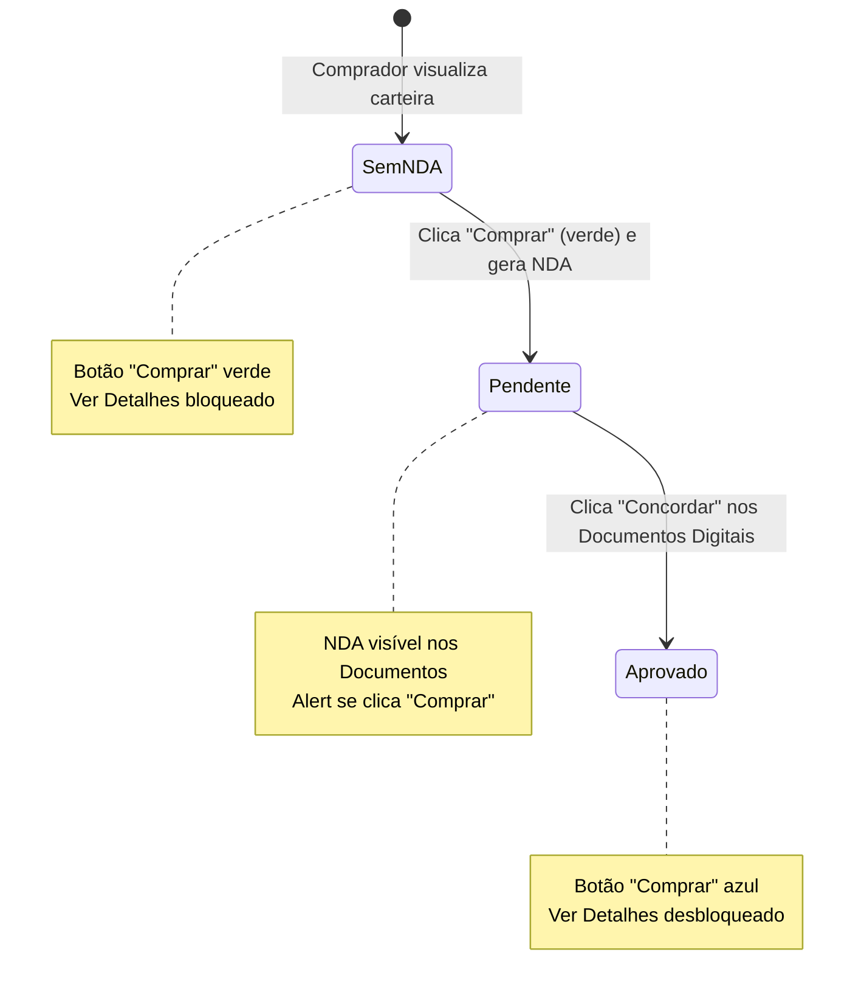
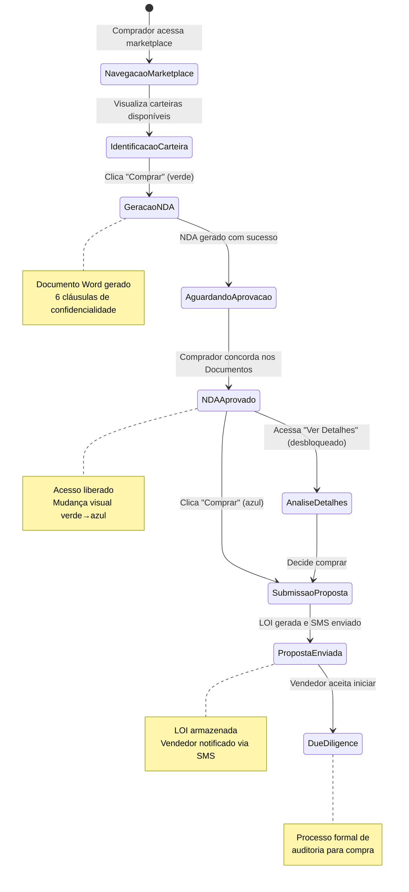
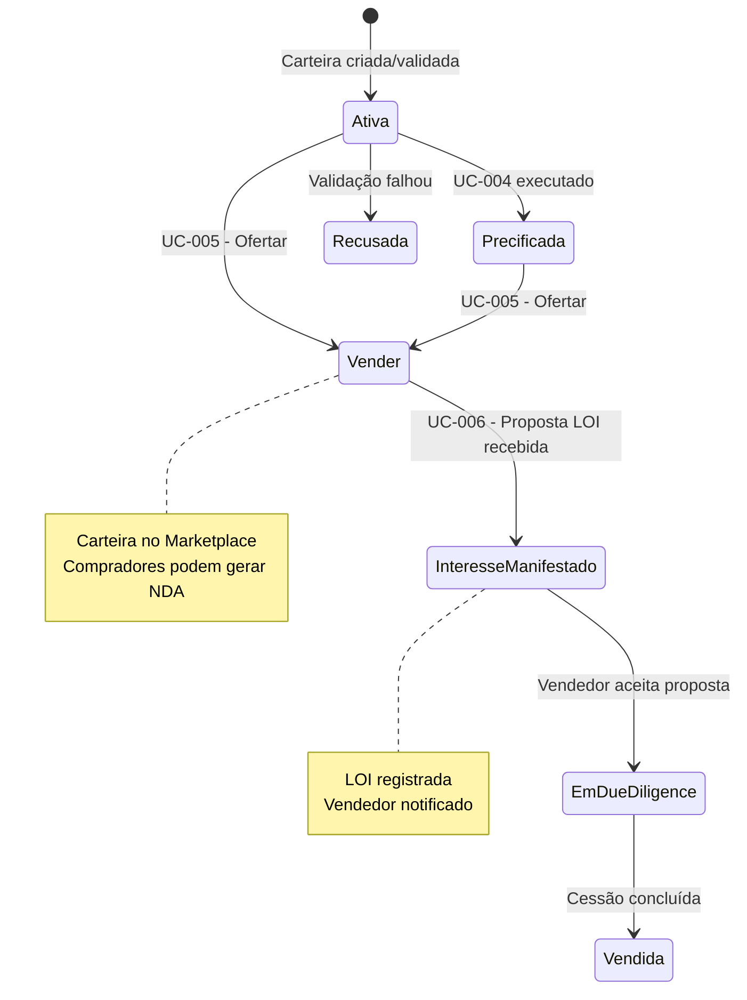

# MARKETPLACE DE CESSÃO DE CRÉDITO CONSIGNADO - (UC-006)

**Versão:** 1.0.0  
**Data de Criação:** 05/02/2026  
**Última Atualização:** 05/02/2026  

---

## 1. Identificação e Resumo

| Campo | Valor |
|-------|-------|
| **ID/Nome** | UC-006 Manifestar Interesse na Compra |
| **Prioridade** | Alta |
| **Versão** | 1.0.0 |
| **Status** | Em Definição |
| **Ator Primário** | Instituição Financeira Compradora (Cessionário) ou seu representante/correspondente |
| **Ator Secundário** | Sistema de Validação de Crédito, Administrador da Plataforma |
| **Descrição** | Permitir que um cessionário manifeste interesse na aquisição de uma carteira de créditos consignados (INSS, SIAPE ou Privado) ofertada no marketplace. O comprador sinaliza oficialmente o interesse através de um processo formal de dois estágios: (1) Assinatura de um Acordo de Confidencialidade (NDA) que libera o acesso aos detalhes da carteira, e (2) Submissão de uma Carta de Intenção de Compra (LOI - Letter of Interest) com valor proposto, iniciando o processo formal de Due Diligence (auditoria) para a compra. O fluxo garante a proteção de dados sensíveis dos titulares conforme LGPD e notifica o vendedor em tempo real via SMS sobre propostas recebidas. |

---

## 2. Contexto de Negócio e Engenharia

### Pré-condições
- Usuário autenticado no sistema como Cessionário (Investidor)
- Carteira de crédito com status "Vender" (publicada no marketplace via UC-005)
- Carteira pertencente a outro participante (o comprador não pode ser o proprietário)
- Comprador com cadastro completo na tabela `participante` (CNPJ, razão social, representante legal)
- E-mail e telefone do vendedor cadastrados para recebimento de notificações SMS
- Configuração do gateway SMS (Twilio) ativa na tabela `configuracao_sistema`
- Ambiente de Produção ativo

### Pós-condições (Sucesso)
- NDA gerado como documento Word (.docx) e armazenado no storage
- Registro de NDA criado na tabela `nda_carteira` com status "Pendente"
- NDA aprovado pelo comprador na área de Documentos Digitais (status "Aprovado")
- Acesso aos detalhes da carteira ("Ver Detalhes") desbloqueado para o comprador
- LOI gerada como documento Word (.docx) contendo dados do proponente, carteira, e proposta
- Registro de proposta criado na tabela `proposta_compra`
- SMS de notificação enviado ao vendedor via Twilio com detalhes da proposta
- Documentos disponíveis na área de Documentos Digitais com abas separadas (NDAs, LOIs, Termos)

### Pós-condições (Falha)
- NDA não aprovado — comprador permanece sem acesso aos detalhes da carteira
- Valor da proposta inválido — LOI não gerada, formulário solicita correção
- NDA não aprovado no servidor — API rejeita geração de LOI (HTTP 403)
- Falha no envio de SMS — proposta registrada normalmente, SMS tratado como não-bloqueante
- Erro na geração do documento Word — resposta de erro ao comprador, nenhum registro criado
- Carteira não encontrada — API retorna HTTP 404

---

## 3. Fluxo Principal (Caminho Feliz)

### Processo de Manifestação de Interesse em 6 Etapas

| Etapa | Nome | Descrição |
|-------|------|-----------|
| 1 | Identificação da Carteira | Comprador navega pelo marketplace e identifica carteira de interesse |
| 2 | Geração do NDA | Comprador solicita NDA clicando no botão "Comprar" (verde) |
| 3 | Aprovação do NDA | Comprador acessa Documentos Digitais e concorda com os termos |
| 4 | Desbloqueio de Acesso | Sistema libera "Ver Detalhes" e altera botão "Comprar" para azul |
| 5 | Submissão da Proposta (LOI) | Comprador informa valor da proposta e submete via modal |
| 6 | Notificação e Registro | Sistema gera LOI, registra proposta e notifica vendedor via SMS |

### Etapas Detalhadas

| Passo | Ação | Validação | Resultado |
|-------|------|-----------|-----------|
| 1.1 | Comprador acessa o Market Place em ambiente de Produção | Usuário autenticado | Página do marketplace carrega com todas as carteiras ativas e em oferta |
| 1.2 | Comprador visualiza carteiras com status "Vender" de outros participantes | Carteira pertence a outro usuário | Botão "Comprar" (verde) e botão "Ver Detalhes" (bloqueado com ícone de cadeado) são exibidos |
| 1.3 | Comprador analisa informações públicas: nome, valor, retorno, títulos, prazo, risco | Dados carregados do banco | Informações básicas visíveis sem necessidade de NDA |
| 2.1 | Comprador clica no botão "Comprar" (verde) na carteira desejada | Carteira com status "Vender", comprador não é proprietário | Modal de NDA é aberto (tema verde) |
| 2.2 | Sistema exibe modal com informações da carteira e explicação do NDA | - | Modal mostra nome da carteira, valor, quantidade de títulos e texto explicativo sobre confidencialidade |
| 2.3 | Comprador clica em "Gerar NDA" | NDA não existente para essa combinação comprador/carteira | API `POST /api/producao/nda` é chamada |
| 2.4 | Sistema verifica se já existe NDA para o comprador e a carteira | Query na tabela `nda_carteira` | Se existente, retorna NDA existente; se não, prossegue com geração |
| 2.5 | Sistema consulta dados do comprador na tabela `participante` | Username do comprador | Razão social, CNPJ, representante legal, e-mail, telefone |
| 2.6 | Sistema consulta dados da carteira na tabela `carteira_agregada` | ID da carteira | Nome, valor total, quantidade de títulos, proprietário |
| 2.7 | Sistema gera documento Word (NDA) com 6 cláusulas | Template preenchido | Arquivo .docx criado com termos de confidencialidade |
| 2.8 | Sistema salva documento no diretório `storage/documentos/producao/` | Diretório existente (criado automaticamente) | Arquivo `nda_{carteiraId}_{username}_{timestamp}.docx` persistido |
| 2.9 | Sistema insere registro na tabela `nda_carteira` com status "Pendente" | Dados completos | Registro criado com ID retornado |
| 2.10 | Modal exibe confirmação de sucesso com instrução para acessar Documentos Digitais | - | Mensagem: "Acesse a área de Documentos Digitais para concordar com os termos" |
| 3.1 | Comprador navega até "Documentos Digitais" no menu lateral (seção STORAGE) | Página carregada | Aba "NDAs" exibe o NDA recém-gerado com status "Pendente" |
| 3.2 | Comprador visualiza detalhes do NDA: carteira, vendedor, data, status | Dados carregados da API | Card do NDA exibido com botão "Concordar" |
| 3.3 | Comprador clica em "Concordar" | NDA com status "Pendente" | Modal de confirmação é exibido |
| 3.4 | Modal de confirmação solicita aceite explícito | - | Texto: "Ao concordar, você se compromete com os termos de confidencialidade" |
| 3.5 | Comprador confirma clicando em "Sim, Concordar" | Username corresponde ao comprador do NDA (verificação server-side) | API `POST /api/producao/nda/aprovar` é chamada |
| 3.6 | Sistema valida propriedade do NDA e atualiza status para "Aprovado" | `username_comprador` confere | Tabela `nda_carteira` atualizada, badge muda para "Aprovado" |
| 4.1 | Comprador retorna ao Market Place | NDA com status "Aprovado" carregado via API | Estado do mapa de NDAs atualizado no frontend |
| 4.2 | Sistema desbloqueia botão "Ver Detalhes" para a carteira (remove ícone de cadeado) | `ndaStatusMap[carteiraId].status === 'Aprovado'` | Link ativo para página de detalhes da carteira |
| 4.3 | Sistema altera botão "Comprar" de verde para azul | NDA aprovado | Indicação visual de que o próximo passo é a proposta (LOI) |
| 5.1 | Comprador clica no botão "Comprar" (azul) | NDA aprovado | Modal de LOI é aberto (tema azul) |
| 5.2 | Modal exibe informações da carteira: nome, valor, títulos, tipo, proprietário | Dados pré-carregados | Seção de resumo da carteira com dados completos |
| 5.3 | Comprador informa o valor da proposta (R$) no campo de input numérico | Valor obrigatório, numérico, maior que zero | Campo de input com placeholder "Digite o valor da proposta" |
| 5.4 | Sistema calcula automaticamente o deságio implícito | Fórmula: `(1 - valorProposta / valorCarteira) × 100` | Deságio exibido em tempo real no painel azul |
| 5.5 | Comprador revisa os dados e clica em "Enviar Proposta" | Valor preenchido | Barra de progresso animada é exibida |
| 6.1 | API `POST /api/producao/proposta` verifica NDA aprovado no servidor | Query: `nda_carteira WHERE status = 'Aprovado'` | Se não aprovado, retorna HTTP 403 |
| 6.2 | Sistema consulta dados completos da carteira com JOIN na tabela `participante` | ID da carteira + dados do vendedor | Telefone do vendedor obtido para SMS |
| 6.3 | Sistema consulta dados do comprador (proponente) | Username do comprador | Dados completos para preenchimento do LOI |
| 6.4 | Sistema calcula deságio implícito | `(1 - valorProposta / valorCarteira) × 100` | Percentual registrado |
| 6.5 | Sistema gera documento Word (LOI) com 5 seções tabuladas | Template preenchido | Arquivo .docx criado com dados da proposta |
| 6.6 | Sistema salva documento no diretório `storage/documentos/producao/` | Diretório existente | Arquivo `loi_{carteiraId}_{username}_{timestamp}.docx` persistido |
| 6.7 | Sistema insere registro na tabela `proposta_compra` | Todos os campos obrigatórios | Proposta registrada com status "Pendente" |
| 6.8 | Sistema obtém credenciais Twilio da tabela `configuracao_sistema` | `codigo = 'sms_gateway'` | Account SID, Auth Token, número de origem |
| 6.9 | Sistema formata telefone do vendedor (prefixo +55 se necessário) | Telefone com DDD | Formato internacional E.164 |
| 6.10 | Sistema envia SMS ao vendedor via API Twilio | Credenciais válidas | Mensagem: "Nova proposta recebida! {comprador} enviou R$ {valor} para a carteira {nome}" |
| 6.11 | Modal exibe tela de sucesso com detalhes da proposta enviada | - | Ícone de check, valor proposto, deságio calculado |
| 6.12 | Proposta aparece na aba "Propostas LOI" da área de Documentos Digitais | Dados carregados | Documento disponível para consulta |

---

## 4. Interface do Usuário - Fluxo Visual

### 4.1 Marketplace - Estado Inicial (Sem NDA)

**Elementos por carteira (cards):**
- Ícone e nome da carteira
- Badge de risco (Baixo/Médio/Alto) com cor correspondente
- Razão social do proprietário (cedente)
- Valor total (formatado: "R$ 266K")
- Retorno estimado (percentual com cor verde)
- Quantidade de títulos
- Prazo médio
- Tipo predominante (INSS, SIAPE, etc.)

**Botões de ação (não-proprietário, sem NDA):**

| Botão | Cor | Ícone | Estado | Ação |
|-------|-----|-------|--------|------|
| Ver Detalhes | Cinza escuro (#21262d) | `ri-lock-line` | Desabilitado (opacity 60%) | Nenhuma (cursor not-allowed) |
| Precificação | Verde (#22c55e) | `ri-calculator-line` | Habilitado | Abre modal de precificação |
| Comprar | Verde (#22c55e) | `ri-shopping-cart-line` | Habilitado | Abre modal de NDA |

**Tooltip em "Ver Detalhes" bloqueado:** "Aprove o NDA para ver detalhes"

### 4.2 Modal de NDA (Tema Verde)

**Elementos da Tela:**
- Ícone circular verde: `ri-shield-check-line` (shield check) sobre fundo `bg-green-500/20`
- Título: "Acordo de Confidencialidade (NDA)"
- Subtítulo: "Necessário para acessar os detalhes da carteira"
- Card de informações da carteira (fundo escuro `#0d1117`):
  - Nome da carteira
  - Valor total com ícone `ri-money-dollar-circle-line`
  - Quantidade de títulos com ícone `ri-file-list-3-line`
- Painel informativo (fundo `bg-green-500/10`, borda `border-green-500/30`):
  - Ícone `ri-information-line`
  - Texto: "Para acessar os detalhes e dados desta carteira, é necessário firmar um Acordo de Confidencialidade (NDA). Este documento protege as informações sensíveis dos titulares e garante o cumprimento da LGPD."

**Botões:**
- "Fechar" — Fecha modal sem ação (fundo `#21262d`)
- "Gerar NDA" — Chama API de geração (fundo `bg-green-600`, ícone `ri-file-shield-2-line`)

**Estado de carregamento:**
- Botão "Gerar NDA" muda para "Gerando..." com ícone `ri-loader-4-line animate-spin`
- Botão desabilitado durante processamento

**Estado pós-geração (sucesso):**
- Painel verde exibe: "NDA gerado com sucesso!" com ícone `ri-checkbox-circle-line`
- Instrução: "Acesse a área de Documentos Digitais para concordar com os termos"
- Botão "Gerar NDA" desaparece

### 4.3 Marketplace - Estado Pós-NDA Aprovado

**Botões de ação (não-proprietário, NDA aprovado):**

| Botão | Cor | Ícone | Estado | Ação |
|-------|-----|-------|--------|------|
| Ver Detalhes | Cinza escuro (#21262d) | `ri-eye-line` | Habilitado (Link) | Navega para `/producao/carteiras/{id}` |
| Precificação | Verde (#22c55e) | `ri-calculator-line` | Habilitado | Abre modal de precificação |
| Comprar | Azul (#2563eb) | `ri-shopping-cart-line` | Habilitado | Abre modal de LOI |

### 4.4 Modal de LOI (Tema Azul)

**Elementos da Tela:**
- Ícone circular azul: `ri-file-text-line` sobre fundo `bg-blue-500/20`
- Título: "Proposta de Compra - Letter of Interest (LOI)"
- Subtítulo: "Envie sua proposta de aquisição"
- Card de resumo da carteira (fundo escuro `#0d1117`):
  - Nome da carteira
  - Grid 2×2: Valor, Títulos, Tipo, Proprietário

**Campo de input:**
- Label: "Valor da Proposta (R$)"
- Tipo: number
- Placeholder: "Digite o valor da proposta"
- Estilo: fundo `#0d1117`, borda `#30363d`, foco em azul

**Painel de cálculo (exibido quando valor > 0):**
- Fundo `bg-blue-500/10`, borda `border-blue-500/30`
- Deságio calculado em tempo real: `((1 - valor_proposta / valor_carteira) × 100)%`
- Exibição: "Deságio implícito: XX.XX%"

**Barra de progresso (durante envio):**
- Barra animada com progresso incremental (0% a 90%)
- Texto: "Gerando proposta..."
- Completa para 100% no retorno da API

**Tela de sucesso (pós-envio):**
- Ícone verde `ri-checkbox-circle-line` em grande
- Título: "Proposta Enviada!"
- Resumo: valor proposto e deságio
- Mensagem: "O vendedor foi notificado via SMS"
- Botão "Fechar"

**Botões do formulário:**
- "Cancelar" — Fecha modal sem ação
- "Enviar Proposta" — Submete a proposta (fundo `bg-blue-600`)

### 4.5 Documentos Digitais - Aba NDAs

**Estrutura de abas:**

| Aba | Nome | Conteúdo |
|-----|------|----------|
| 1 | NDAs | Acordos de Confidencialidade do comprador |
| 2 | Propostas LOI | Cartas de Intenção enviadas/recebidas |
| 3 | Termos de Cessão | Termos gerados via UC-005 |

**Card de NDA (na aba NDAs):**
- Ícone: `ri-shield-check-line`
- Nome da carteira vinculada
- ID da carteira
- Vendedor (username)
- Data de criação
- Badge de status: "Pendente" (amarelo) ou "Aprovado" (verde)
- Botão "Concordar" (somente quando status = "Pendente")

**Modal de confirmação do NDA:**
- Título: "Confirmar Aprovação do NDA"
- Texto: "Ao concordar, você se compromete com os termos de confidencialidade estabelecidos para a carteira {nome}. Esta ação é irreversível."
- Botão "Cancelar"
- Botão "Sim, Concordar" (verde)

### 4.6 Documentos Digitais - Aba Propostas LOI

**Card de Proposta:**
- Ícone: `ri-file-text-line`
- Nome da carteira
- Badge de papel: "Comprador" (azul) ou "Vendedor" (verde)
- Valor da carteira
- Valor da proposta
- Deságio calculado
- Data de criação
- Badge de status: "Pendente" (amarelo)

---

## 5. Documentos Gerados

### 5.1 Documento NDA - Acordo de Confidencialidade

O sistema gera automaticamente um documento .docx contendo:

**Cabeçalho:**
- Título: "ACORDO DE CONFIDENCIALIDADE"
- Subtítulo: "(Non-Disclosure Agreement - NDA)"
- Identificador do ambiente: "[AMBIENTE DE PRODUÇÃO]" (cor verde #22c55e)

**Seção PARTES:**
- PARTE RECEPTORA (Interessado na Aquisição):
  - Razão Social do comprador
  - CNPJ
  - Representante Legal (nome, CPF, cargo)
  - E-mail e Telefone
- PARTE DIVULGADORA (Proprietário da Carteira):
  - Username do proprietário

**Seção OBJETO:**
- Descrição do acordo vinculado à carteira específica
- Identificação da carteira (nome, ID, quantidade de títulos, valor total)

**Cláusula 1 - INFORMAÇÕES CONFIDENCIAIS:**
- Definição abrangente de informações confidenciais (5 itens):
  - a) Dados individuais dos beneficiários e devedores
  - b) Valores, taxas de juros, prazos e condições
  - c) Informações sobre inadimplência e histórico de pagamentos
  - d) Métodos de precificação, modelos de risco e estratégias de cobrança
  - e) Dados pessoais protegidos pela LGPD (Lei nº 13.709/2018)

**Cláusula 2 - OBRIGAÇÕES DA PARTE RECEPTORA:**
- 5 compromissos formais (alíneas a-e)
- Uso exclusivo para avaliação de aquisição
- Proibição de divulgação a terceiros
- Sigilo absoluto
- Medidas de segurança adequadas
- Conformidade integral com a LGPD

**Cláusula 3 - PRAZO DE VIGÊNCIA:**
- 2 anos de vigência + 5 anos de obrigação de confidencialidade pós-término

**Cláusula 4 - PENALIDADES:**
- Multa de 20% do valor total da carteira
- Sem prejuízo de indenização por perdas e danos
- Responsabilização civil e criminal

**Cláusula 5 - LGPD E PROTEÇÃO DE DADOS:**
- Declaração de cumprimento integral da Lei nº 13.709/2018
- Medidas técnicas e administrativas adequadas

**Cláusula 6 - FORO:**
- Comarca de São Paulo/SP

**Rodapé:**
- Espaço para assinatura da PARTE RECEPTORA
- Local e data
- Mensagem: "Documento gerado eletronicamente pela plataforma CreditFlow"

### 5.2 Documento LOI - Carta de Intenção de Compra

O sistema gera automaticamente um documento .docx contendo:

**Cabeçalho:**
- Título: "LETTER OF INTEREST (LOI)"
- Subtítulo: "CARTA DE INTENÇÃO DE COMPRA DE CARTEIRA DE CRÉDITO"
- Identificador do ambiente: "[AMBIENTE DE PRODUÇÃO]" (cor verde #22c55e)

**Seção 1 - IDENTIFICAÇÃO DO PROPONENTE:**
| Campo | Fonte |
|-------|-------|
| Razão Social | `participante.razao_social` |
| CNPJ | `participante.cnpj` |
| Representante | `participante.representante_nome` + cargo |
| E-mail | `participante.email` |
| Telefone | `participante.telefone` |

**Seção 2 - IDENTIFICAÇÃO DA CARTEIRA:**
| Campo | Fonte |
|-------|-------|
| ID da Carteira | `carteira_agregada.id_carteira` |
| Nome | `carteira_agregada.nome_carteira` |
| Proprietário | `participante.razao_social` (vendedor) |
| CNPJ Proprietário | `participante.cnpj` (vendedor) |
| Tipo Predominante | `carteira_agregada.tipo_predominante` |
| Qtd. Títulos | `carteira_agregada.qtd_titulos` |
| Valor Nominal Total | `carteira_agregada.valor_total` |
| Data de Criação | `carteira_agregada.created_at` |

**Seção 3 - PROPOSTA DE AQUISIÇÃO:**
| Campo | Cálculo |
|-------|---------|
| Valor da Proposta | Informado pelo comprador |
| Deságio Implícito | `(1 - valor_proposta / valor_carteira) × 100` |
| Data da Proposta | Data atual (formato "dd de MMMM de yyyy") |

**Seção 4 - DECLARAÇÕES:**
- 4.1. Não constitui compromisso definitivo de compra
- 4.2. Capacidade financeira e operacional do proponente
- 4.3. Validade de 30 dias corridos, renovável
- 4.4. Ciência e vinculação ao NDA previamente firmado

**Seção 5 - CONDIÇÕES PRECEDENTES:**
- a) Aprovação regulatória junto ao BACEN
- b) Conclusão satisfatória da due diligence
- c) Negociação e assinatura de contrato definitivo
- d) Registro da cessão junto às entidades registradoras

**Rodapé:**
- Espaço para assinatura do PROPONENTE
- Local e data
- Mensagem: "Documento gerado eletronicamente pela plataforma CreditFlow"

### 5.3 Armazenamento

| Ambiente | Diretório |
|----------|-----------|
| Produção | `storage/documentos/producao/` |

**Nomenclatura dos arquivos:**
| Documento | Padrão |
|-----------|--------|
| NDA | `nda_{carteiraId}_{username}_{timestamp}.docx` |
| LOI | `loi_{carteiraId}_{username}_{timestamp}.docx` |

---

## 6. Regras de Negócio (RN)

### RN01 – Elegibilidade para Manifestar Interesse
- Apenas carteiras com status "Vender" permitem manifestação de interesse
- O comprador não pode ser o proprietário da carteira (owner check no frontend)
- Proprietários veem botão "Ofertar" / "Em Oferta" ao invés de "Comprar"

### RN02 – NDA Obrigatório Antes do Acesso
- O botão "Ver Detalhes" permanece bloqueado (ícone de cadeado) até que o NDA seja aprovado
- O bloqueio é verificado no frontend via mapa de status: `ndaStatusMap[carteiraId].status === 'Aprovado'`
- O tooltip "Aprove o NDA para ver detalhes" orienta o comprador

### RN03 – Unicidade do NDA por Par Comprador/Carteira
- Existe no máximo um NDA por combinação `(id_carteira, username_comprador)`
- Se NDA já existe, a API retorna o NDA existente sem criar duplicata
- NDA pode ter status: "Pendente" ou "Aprovado"

### RN04 – Aprovação do NDA com Verificação de Propriedade
- Somente o `username_comprador` registrado pode aprovar o NDA (verificação server-side)
- Tentativa de aprovação por outro usuário retorna HTTP 403 "Acesso não autorizado"
- NDA já aprovado retorna sucesso idempotente sem erro

### RN05 – NDA Aprovado como Pré-requisito para LOI
- A API de proposta (`/api/producao/proposta`) valida server-side que existe NDA com status "Aprovado"
- Se NDA não existe ou não está aprovado, retorna HTTP 403 com mensagem explicativa
- Esta validação server-side previne bypass via chamada direta à API

### RN06 – Cálculo do Deságio
- Deságio = `(1 - valor_proposta / valor_carteira) × 100`
- Calculado em tempo real no frontend durante digitação
- Calculado novamente no backend durante geração do LOI
- Deságio pode ser positivo (desconto), zero (valor nominal), ou negativo (ágio/prêmio)

### RN07 – Validade da Proposta
- Toda LOI tem validade de 30 dias corridos conforme cláusula 4.3 do documento
- Renovação mediante manifestação expressa do proponente

### RN08 – Notificação SMS ao Vendedor
- SMS enviado automaticamente após registro da proposta
- Utiliza credenciais Twilio da tabela `configuracao_sistema` (codigo = 'sms_gateway')
- Campos: Account SID (`senha`), Auth Token (`api_key`), número de origem (`login`)
- Telefone formatado para padrão E.164 (+55DDDNÚMERO)
- Mensagem: "CreditFlow - Nova proposta recebida! {comprador} enviou uma proposta de R$ {valor} para a carteira {nome}. Acesse a plataforma para mais detalhes."
- Falha no SMS é tratada como não-bloqueante (não impede o registro da proposta)

### RN09 – Indicação Visual de Estado
- Botão "Comprar" verde (#22c55e): NDA não gerado — primeira etapa do fluxo
- Botão "Comprar" azul (#2563eb): NDA aprovado — segunda etapa (LOI)
- NDA com status "Pendente": badge amarelo, botão "Concordar" visível
- NDA com status "Aprovado": badge verde, sem botão de ação

### RN10 – Documentos Disponíveis para Ambas as Partes
- NDAs visíveis para o comprador que os gerou
- Propostas LOI visíveis tanto para o comprador quanto para o vendedor
- Badge "Comprador" (azul) ou "Vendedor" (verde) identifica o papel do usuário

---

## 7. Fluxos Alternativos e de Exceção

### FA01 – NDA Já Existente para a Carteira
- **Trigger:** Comprador clica "Comprar" mas já possui NDA para essa carteira
- **Ação:** Se status "Pendente", alerta: "Você precisa aprovar o NDA na área de Documentos Digitais"
- **Comportamento:** Modal não é aberto, usuário é direcionado aos Documentos
- **Retorno:** Fluxo interrompido até aprovação do NDA

### FA02 – Comprador Tenta Comprar Própria Carteira
- **Trigger:** Usuário é proprietário da carteira
- **Ação:** Botão "Comprar" não é renderizado; em seu lugar aparece "Ofertar" ou "Em Oferta"
- **Comportamento:** Lógica `owner` no frontend separa os caminhos
- **Retorno:** Nenhuma ação de compra possível

### FA03 – NDA Pendente de Aprovação
- **Trigger:** Comprador clica "Comprar" com NDA em status "Pendente"
- **Ação:** Alert JavaScript: "Você precisa aprovar o NDA na área de Documentos Digitais"
- **Comportamento:** Usuário permanece no marketplace
- **Retorno:** Necessário navegar até Documentos Digitais

### FA04 – Proposta Sem Valor Informado
- **Trigger:** Comprador tenta enviar proposta sem digitar valor
- **Ação:** Alert: "Informe o valor da proposta"
- **Comportamento:** Modal permanece aberto, campo de valor destacado
- **Retorno:** Usuário corrige e resubmete

### FA05 – Erro na Geração do Documento NDA
- **Trigger:** Falha ao criar arquivo .docx (permissão, disco, etc.)
- **Ação:** API retorna HTTP 500 com mensagem de erro
- **Comportamento:** Nenhum registro é criado no banco
- **Retorno:** Console exibe erro, retry disponível

### FA06 – Erro na Geração do Documento LOI
- **Trigger:** Falha ao criar arquivo .docx
- **Ação:** API retorna HTTP 500 com mensagem de erro
- **Comportamento:** Nenhum registro é criado no banco, SMS não é enviado
- **Retorno:** Barra de progresso para, modal exibe erro

### FA07 – Falha no Envio de SMS Twilio
- **Trigger:** Credenciais Twilio inválidas, telefone incorreto, ou serviço indisponível
- **Ação:** Erro capturado e registrado no console (`console.error`)
- **Comportamento:** Proposta é registrada normalmente, resposta de sucesso retornada
- **Retorno:** Proposta válida, vendedor não recebe SMS (será notificado ao acessar a plataforma)

### FA08 – Carteira Não Encontrada
- **Trigger:** ID da carteira inválido ou carteira removida
- **Ação:** API retorna HTTP 404 "Carteira não encontrada"
- **Comportamento:** Modal exibe erro
- **Retorno:** Fluxo interrompido

### FA09 – Comprador Sem Cadastro Completo
- **Trigger:** Dados do participante incompletos (CNPJ, razão social, etc.)
- **Ação:** NDA/LOI gerado com campos marcados como "Não informado"
- **Comportamento:** Documento criado com dados parciais
- **Retorno:** Fluxo completa, mas documento pode ser inadequado para fins legais

### FA10 – Cancelamento pelo Usuário
- **Trigger:** Comprador fecha modal (NDA ou LOI) antes de concluir
- **Ação:** Estados do modal são resetados
- **Comportamento:** Nenhuma alteração no sistema
- **Retorno:** Retorno ao marketplace sem efeitos colaterais

---

## 8. Integrações e APIs

### 8.1 API de Geração de NDA
```
POST /api/producao/nda
Request: {
  username: string,      // Username do comprador
  carteiraId: string     // ID da carteira
}
Response (Sucesso): {
  success: true,
  ndaId: number,         // ID do registro na tabela nda_carteira
  fileName: string,      // Nome do arquivo gerado
  path: string,          // Caminho relativo do arquivo
  status: "Pendente"     // Status inicial do NDA
}
Response (NDA existente): {
  success: true,
  message: "NDA já existe",
  status: "Pendente" | "Aprovado",
  ndaId: number
}
Response (Erro): {
  success: false,
  error: string
}
```

### 8.2 API de Status do NDA
```
GET /api/producao/nda/status?username={username}&carteiraId={carteiraId}

// Consulta individual (com carteiraId):
Response: {
  success: true,
  hasNda: boolean,
  ndaId?: number,
  status?: "Pendente" | "Aprovado",
  ndaPath?: string,
  createdAt?: string
}

// Consulta em lote (sem carteiraId):
Response: {
  success: true,
  ndas: [
    {
      id: number,
      carteiraId: string,
      nomeCarteira: string,
      status: string,
      ndaPath: string,
      vendedor: string,
      criadoEm: string
    }
  ],
  ndaMap: {
    [carteiraId: string]: {
      status: string,
      ndaId: number
    }
  }
}
```

### 8.3 API de Aprovação do NDA
```
POST /api/producao/nda/aprovar
Request: {
  ndaId: number,       // ID do NDA na tabela
  username: string     // Username do comprador (para verificação)
}
Response (Sucesso): {
  success: true,
  message: "NDA aprovado com sucesso"
}
Response (Não autorizado): {
  success: false,
  error: "Acesso não autorizado"     // HTTP 403
}
Response (Não encontrado): {
  success: false,
  error: "NDA não encontrado"        // HTTP 404
}
```

### 8.4 API de Submissão de Proposta (LOI)
```
POST /api/producao/proposta
Request: {
  username: string,          // Username do comprador
  carteiraId: string,        // ID da carteira
  valorProposta: number      // Valor da proposta em reais
}
Response (Sucesso): {
  success: true,
  fileName: string,          // Nome do arquivo LOI gerado
  path: string,              // Caminho relativo do arquivo
  valorProposta: number,     // Valor da proposta
  desagio: number            // Deságio calculado (percentual)
}
Response (NDA não aprovado): {
  success: false,
  error: "NDA não aprovado. Aprove o NDA antes de enviar uma proposta."   // HTTP 403
}
Response (Erro): {
  success: false,
  error: string
}
```

### 8.5 API de Documentos Digitais
```
GET /api/producao/documentos?username={username}
Response: {
  success: true,
  documentos: [...],      // Termos de Cessão (UC-005)
  ndas: [...],            // NDAs do comprador
  propostas: [...]        // Propostas LOI (como comprador e vendedor)
}
```

### 8.6 Integração Twilio (SMS)

| Parâmetro | Fonte |
|-----------|-------|
| Account SID | `configuracao_sistema.senha` WHERE `codigo = 'sms_gateway'` |
| Auth Token | `configuracao_sistema.api_key` WHERE `codigo = 'sms_gateway'` |
| From Number | `configuracao_sistema.login` WHERE `codigo = 'sms_gateway'` |
| To Number | `participante.telefone` do vendedor (formatado +55) |

**Endpoint Twilio:**
```
POST https://api.twilio.com/2010-04-01/Accounts/{AccountSid}/Messages.json
Headers: Authorization: Basic {base64(AccountSid:AuthToken)}
Content-Type: application/x-www-form-urlencoded
Body: To={formattedPhone}&From={fromNumber}&Body={mensagem}
```

### 8.7 Estrutura de Dados

**Tabela: nda_carteira**

| Coluna | Tipo | Nullable | Default | Descrição |
|--------|------|----------|---------|-----------|
| id | SERIAL | NOT NULL | autoincrement | Chave primária |
| id_carteira | VARCHAR | NOT NULL | - | ID da carteira (FK lógica para carteira_agregada) |
| nome_carteira | VARCHAR | YES | - | Nome da carteira para exibição |
| username_comprador | VARCHAR | NOT NULL | - | Username do comprador (FK lógica para participante) |
| username_vendedor | VARCHAR | YES | - | Username do vendedor/proprietário |
| nda_path | VARCHAR | YES | - | Caminho do documento .docx gerado |
| status | VARCHAR | YES | 'Pendente' | Status: "Pendente" ou "Aprovado" |
| created_at | TIMESTAMP | YES | now() | Data de criação |
| updated_at | TIMESTAMP | YES | now() | Data da última atualização |

**Tabela: proposta_compra**

| Coluna | Tipo | Nullable | Default | Descrição |
|--------|------|----------|---------|-----------|
| id | SERIAL | NOT NULL | autoincrement | Chave primária |
| id_carteira | VARCHAR | NOT NULL | - | ID da carteira |
| nome_carteira | VARCHAR | YES | - | Nome da carteira |
| username_comprador | VARCHAR | NOT NULL | - | Username do comprador/proponente |
| username_vendedor | VARCHAR | YES | - | Username do vendedor/proprietário |
| valor_carteira | NUMERIC | YES | - | Valor nominal total da carteira |
| valor_proposta | NUMERIC | NOT NULL | - | Valor ofertado pelo comprador |
| loi_path | VARCHAR | YES | - | Caminho do documento LOI .docx |
| status | VARCHAR | YES | 'Pendente' | Status da proposta |
| ambiente | VARCHAR | YES | 'producao' | Ambiente: "producao" |
| created_at | TIMESTAMP | YES | now() | Data de criação |
| updated_at | TIMESTAMP | YES | now() | Data da última atualização |

---

## 9. Requisitos Não Funcionais (RNF)

### RNF01 – Performance
- Geração de documento NDA: máximo 5 segundos
- Geração de documento LOI: máximo 10 segundos
- Verificação de status NDA: máximo 2 segundos
- Carregamento do mapa de NDAs (batch): máximo 3 segundos
- Envio de SMS: máximo 5 segundos (não-bloqueante)

### RNF02 – Segurança
- Validação server-side de NDA aprovado antes de aceitar LOI (HTTP 403 se não aprovado)
- Verificação de propriedade do NDA antes de permitir aprovação (HTTP 403 se não é o comprador)
- Queries parametrizadas em todas as APIs (prevenção de SQL injection)
- Credenciais Twilio armazenadas na tabela `configuracao_sistema` (não hardcoded)
- Autenticação Basic para API Twilio com base64 encoding
- Documentos armazenados no servidor com permissões restritas

### RNF03 – Usabilidade
- Interface responsiva com breakpoints adequados
- Feedback visual em todas as etapas (loading, sucesso, erro)
- Mudança de cor nos botões indica progresso no fluxo (verde → azul)
- Ícone de cadeado comunica claramente o bloqueio de acesso
- Tooltips explicativos nos elementos bloqueados
- Barra de progresso animada durante geração de documentos
- Cálculo de deságio em tempo real durante digitação

### RNF04 – Rastreabilidade
- Todos os documentos gerados com timestamp no nome do arquivo
- Registros de NDA e proposta com `created_at` e `updated_at`
- Documentos disponíveis na área de Documentos Digitais para consulta posterior
- Path do documento armazenado no banco de dados para referência

### RNF05 – Resiliência
- SMS tratado como operação não-bloqueante (try/catch isolado)
- NDA existente retornado sem criar duplicata (idempotência)
- Aprovação de NDA já aprovado retorna sucesso sem erro (idempotência)
- Criação automática do diretório de storage (`mkdir recursive: true`)

### RNF06 – Conformidade Legal
- NDA inclui cláusulas de proteção à LGPD (Lei nº 13.709/2018)
- Vigência de 2 anos + 5 anos de obrigação de confidencialidade
- Multa de 20% do valor da carteira por violação
- Foro de São Paulo/SP
- LOI com declaração de não-vinculação definitiva
- LOI com validade de 30 dias
- Condições precedentes incluem aprovação BACEN e registro em entidades registradoras

---

## 10. Diagrama de Sequência (UML)

### 10.1 Fluxo de Geração e Aprovação do NDA



### 10.2 Fluxo de Submissão da Proposta (LOI)



---

## 11. Fluxo de Estados

### 11.1 Estados do NDA



### 11.2 Estados da Compra (Jornada do Comprador)



### 11.3 Fluxo de Estados da Carteira (Complemento UC-005)



---

## 12. Indicadores e Impacto nos Dashboards

Após implementação do UC-006, os seguintes dados ficam disponíveis:

| Indicador | Descrição | Fonte |
|-----------|-----------|-------|
| NDAs Pendentes | Quantidade de NDAs aguardando aprovação do comprador | `nda_carteira WHERE status = 'Pendente'` |
| NDAs Aprovados | Quantidade de NDAs com acesso liberado | `nda_carteira WHERE status = 'Aprovado'` |
| Propostas Recebidas | Total de LOIs recebidas por um vendedor | `proposta_compra WHERE username_vendedor = ?` |
| Propostas Enviadas | Total de LOIs enviadas por um comprador | `proposta_compra WHERE username_comprador = ?` |
| Volume Proposto | Soma dos valores das propostas recebidas | `SUM(valor_proposta) FROM proposta_compra` |
| Deságio Médio | Média do deságio das propostas | Calculado a partir de `valor_proposta / valor_carteira` |
| Taxa de Conversão NDA→LOI | Percentual de NDAs que resultaram em proposta | `proposta_compra / nda_carteira WHERE status = 'Aprovado'` |

---

## 13. Considerações de Implementação

### 13.1 Ambiente de Produção

| Aspecto | Valor |
|---------|-------|
| Diretório de Docs | `storage/documentos/producao/` |
| APIs | `/api/producao/nda`, `/api/producao/nda/status`, `/api/producao/nda/aprovar`, `/api/producao/proposta` |
| Cor do Tema NDA | Verde (#22c55e) |
| Cor do Tema LOI | Azul (#2563eb) |
| Validação NDA | Server-side obrigatória |
| SMS | Via Twilio (credenciais em configuracao_sistema) |

### 13.2 Bibliotecas Utilizadas

| Biblioteca | Uso |
|------------|-----|
| `docx` | Geração de documentos Word (.docx) — Document, Packer, Paragraph, TextRun, Table, TableRow, TableCell |
| `fs/promises` | writeFile, mkdir para persistência de arquivos |
| `path` | Construção de caminhos de arquivo |
| `next/server` | NextRequest, NextResponse para API Routes |
| `pg` (pool) | Conexão com PostgreSQL via pool de conexões |

### 13.3 Padrões de Código

| Padrão | Implementação |
|--------|---------------|
| Verificação de duplicatas | Query antes de INSERT para NDA |
| Idempotência | Aprovação de NDA já aprovado retorna sucesso |
| Queries parametrizadas | Todos os `$1, $2...` para prevenção de SQL injection |
| Tratamento de erros | try/catch com console.error e resposta HTTP adequada |
| SMS não-bloqueante | try/catch isolado para envio Twilio |
| Criação de diretório | `mkdir({ recursive: true })` antes de writeFile |

---

## 14. Histórico de Versões

| Versão | Data | Autor | Alterações |
|--------|------|-------|------------|
| 1.0.0 | 05/02/2026 | CreditFlow | Criação do documento — Fluxo completo NDA + LOI |

---

## 15. Aprovações

| Papel | Nome | Data | Assinatura |
|-------|------|------|------------|
| Product Owner | - | - | Pendente |
| Tech Lead | - | - | Pendente |
| Compliance | - | - | Pendente |
| QA Lead | - | - | Pendente |
| DPO (LGPD) | - | - | Pendente |

---

*Documento gerado automaticamente pelo sistema CreditFlow*  
*Confidencial - Uso interno*
