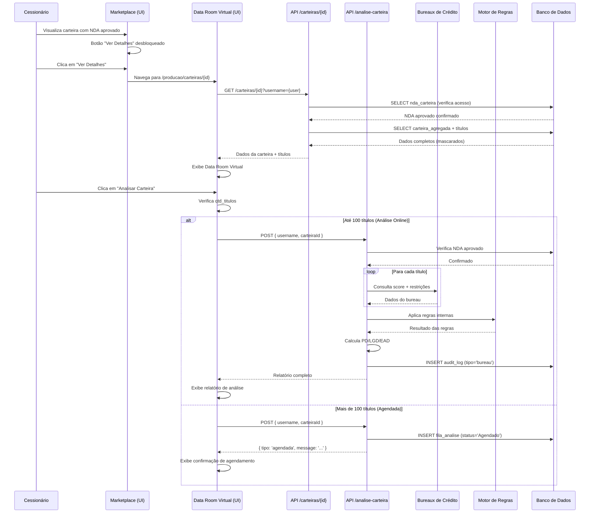
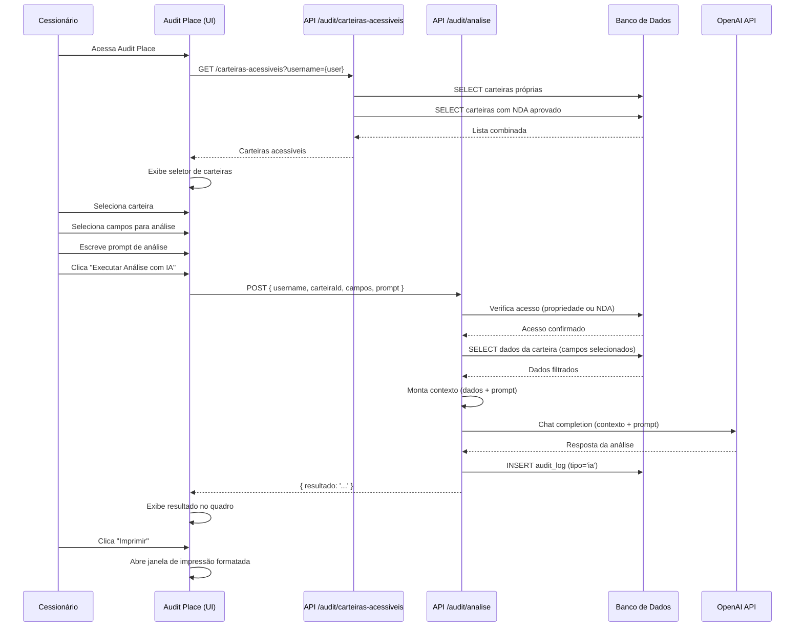
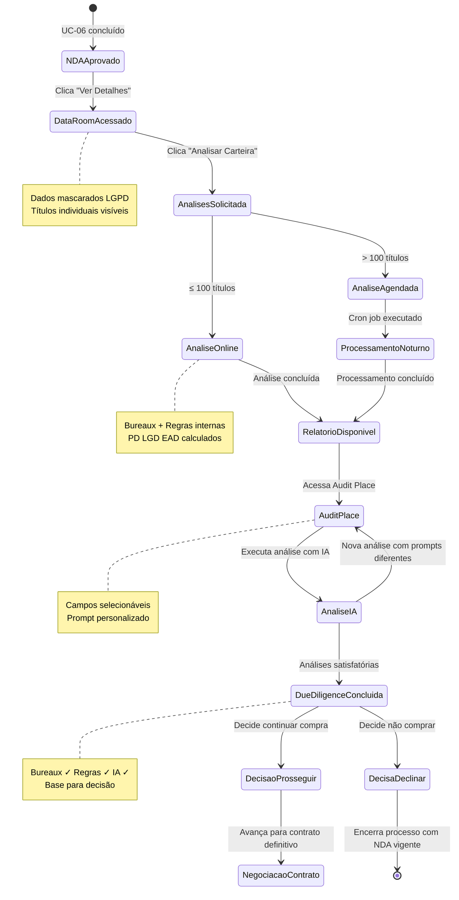
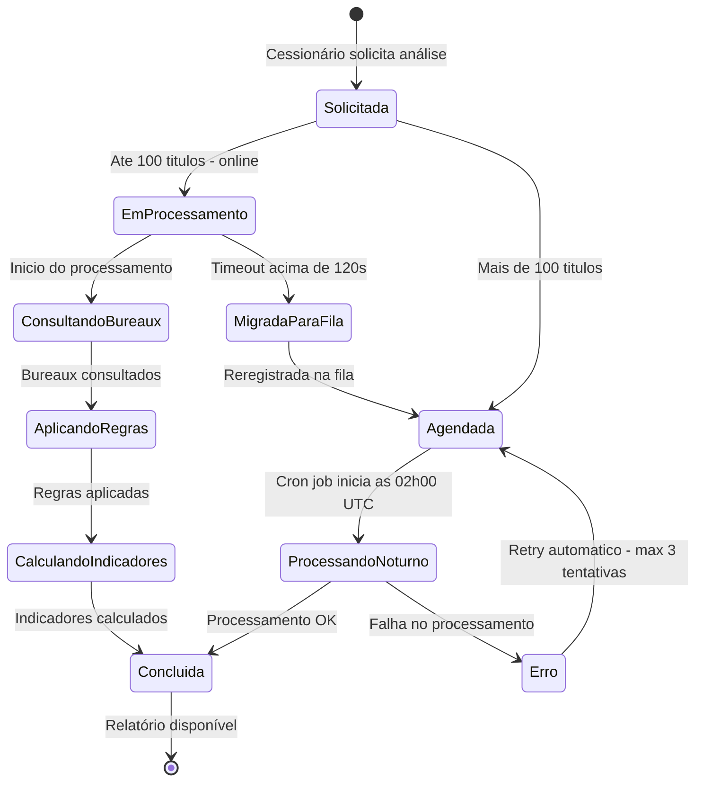

# MARKETPLACE DE CESSÃO DE CRÉDITO CONSIGNADO - (UC-007)

**Versão:** 1.0.0  
**Data de Criação:** 07/02/2026  
**Última Atualização:** 07/02/2026  

---

## 1. Identificação e Resumo

| Campo | Valor |
|-------|-------|
| **ID/Nome** | UC-007 Due Diligence da Carteira de Crédito |
| **Prioridade** | Alta |
| **Versão** | 1.0.0 |
| **Status** | Em Definição |
| **Ator Primário** | Instituição Financeira Compradora (Cessionário) ou seu representante/correspondente |
| **Ator Secundário** | Sistema de Análise de Risco, Bureaux de Crédito, Motor de IA (Audit Place), DPO (Data Protection Officer), Administrador da Plataforma |
| **Descrição** | Permitir que o cessionário, após formalizar interesse na compra (UC-06) e obter aprovação do NDA, conduza o processo completo de Due Diligence (auditoria) sobre a carteira de crédito. O fluxo abrange: (1) Acesso ao Data Room Virtual com os detalhes e títulos da carteira; (2) Análise automatizada da carteira junto aos bureaux de crédito e regras internas da plataforma (online para carteiras com até 100 títulos, agendada via cron job noturno para carteiras maiores); (3) Análise complementar com Inteligência Artificial via Audit Place, onde o cessionário seleciona campos específicos e cria prompts personalizados para validar legalidade e fidelidade da carteira. O processo garante conformidade com a LGPD, governança de dados e proteção de informações sensíveis dos titulares. |

---

## 2. Contexto de Negócio e Engenharia

### Pré-condições

- O cessionário deve estar habilitado no marketplace (UC-01).
- A carteira deve estar publicada e com interesse formalizado (UC-06).
- Deve existir acordo de confidencialidade (NDA) ativo com status "Aprovado" na tabela `nda_carteira`.
- O perfil do usuário deve permitir acesso a dados sensíveis (role = `cessionario` ou `ambos`).
- O módulo de governança de dados deve estar operacional (tabelas de auditoria e logging ativas).
- O DPO (Data Protection Officer) deve ter aprovado os fluxos de acesso (registro na tabela `configuracao_sistema` com codigo = `dpo_aprovacao`).
- O ambiente seguro (Data Room Virtual) deve estar disponível — página de detalhes da carteira (`/producao/carteiras/{id}`).
- Usuário autenticado no sistema com MFA validado.
- Carteira pertencente a outro participante (o comprador não pode ser o proprietário).
- Configuração dos bureaux de crédito ativa na tabela `configuracao_sistema`.
- Chave de API OpenAI configurada para funcionalidade Audit Place.

### Pós-condições (Sucesso)

- Cessionário acessa o Data Room Virtual com todos os detalhes da carteira e seus títulos.
- Análise automatizada da carteira executada com sucesso junto aos bureaux e regras internas.
- Relatório de análise de risco gerado com indicadores PD/LGD/EAD, score de risco e recomendação.
- Análise complementar com IA (Audit Place) executada sobre campos selecionados pelo cessionário.
- Resultado da análise IA disponível para impressão.
- Registro de todas as análises realizadas na tabela `audit_log` para rastreabilidade.
- Cessionário possui informações suficientes para decidir sobre a continuidade da aquisição.
- Conformidade com LGPD mantida em todas as etapas do processo.

### Pós-condições (Falha)

- NDA não aprovado — acesso ao Data Room Virtual negado (HTTP 403).
- Carteira com mais de 100 títulos — análise automatizada agendada para cron job noturno, cessionário notificado.
- Falha na conexão com bureaux de crédito — análise parcial com dados disponíveis, alerta ao cessionário.
- Chave de API OpenAI inválida ou indisponível — análise IA retorna erro, botão de retry disponível.
- Carteira sem títulos vinculados — análise não pode ser executada, mensagem informativa exibida.
- Timeout na análise online (> 120 segundos) — análise automaticamente migrada para fila do cron job.
- DPO não aprovou fluxo de acesso — funcionalidades de dados sensíveis bloqueadas.

---

## 3. Fluxo Principal (Caminho Feliz)

### Processo de Due Diligence em 8 Etapas

| Etapa | Nome | Descrição |
|-------|------|-----------|
| 1 | Acesso ao Data Room Virtual | Cessionário acessa detalhes da carteira após aprovação do NDA |
| 2 | Visualização dos Títulos | Cessionário visualiza a composição da carteira (títulos individuais) |
| 3 | Solicitação de Análise Automatizada | Cessionário solicita análise da carteira junto aos bureaux e regras internas |
| 4 | Processamento da Análise | Sistema executa análise online (≤ 100 títulos) ou agenda para cron job (> 100 títulos) |
| 5 | Recebimento do Relatório | Cessionário recebe relatório de análise com indicadores de risco |
| 6 | Acesso ao Audit Place | Cessionário acessa a funcionalidade de análise com IA |
| 7 | Configuração e Execução da Análise IA | Cessionário seleciona carteira, campos e cria prompt de análise |
| 8 | Conclusão da Due Diligence | Cessionário imprime resultados e conclui o processo de auditoria |

### Etapas Detalhadas

| Passo | Ação | Validação | Resultado |
|-------|------|-----------|-----------|
| **ETAPA 1 — Acesso ao Data Room Virtual** |||
| 1.1 | Cessionário acessa o Marketplace em ambiente de Produção | Usuário autenticado, role permitida | Página do marketplace carrega com carteiras ativas |
| 1.2 | Cessionário identifica carteira com NDA aprovado (botão "Ver Detalhes" desbloqueado) | `ndaStatusMap[carteiraId].status === 'Aprovado'` | Botão "Ver Detalhes" com ícone de olho (`ri-eye-line`) habilitado |
| 1.3 | Cessionário clica em "Ver Detalhes" | NDA aprovado | Navegação para `/producao/carteiras/{id}` — Data Room Virtual |
| 1.4 | Sistema valida acesso server-side verificando NDA aprovado | Query: `nda_carteira WHERE id_carteira = ? AND username_comprador = ? AND status = 'Aprovado'` | Se não aprovado, redireciona para marketplace com alerta |
| 1.5 | Sistema carrega dados completos da carteira | Query: `carteira_agregada WHERE id_carteira = ?` | Exibe: nome, valor total, quantidade de títulos, tipo predominante, risco, retorno estimado, prazo médio, data de criação, proprietário |
| **ETAPA 2 — Visualização dos Títulos** |||
| 2.1 | Cessionário visualiza seção "Composição da Carteira" | Dados carregados do banco | Lista de títulos individuais com colunas: ID, beneficiário (mascarado conforme LGPD), valor nominal, taxa, prazo, status |
| 2.2 | Sistema aplica mascaramento LGPD em dados sensíveis | Regras de governança de dados | CPF mascarado (***.***.XXX-XX), nome parcialmente oculto, dados financeiros visíveis |
| 2.3 | Cessionário pode filtrar e ordenar títulos | Controles de filtro na interface | Filtros por status, faixa de valor, prazo, tipo |
| 2.4 | Cessionário visualiza resumo estatístico da composição | Cálculos agregados | Distribuição por tipo, faixa de prazo, concentração por faixa de valor, taxa média ponderada |
| **ETAPA 3 — Solicitação de Análise Automatizada** |||
| 3.1 | Cessionário clica no botão "Analisar Carteira" na página de detalhes | Carteira com títulos vinculados | Modal de confirmação exibido |
| 3.2 | Sistema verifica quantidade de títulos da carteira | `qtd_titulos` da carteira | Se ≤ 100: informa "Análise será executada online (tempo estimado: X minutos)"; Se > 100: informa "Análise será agendada para processamento noturno" |
| 3.3 | Cessionário confirma solicitação de análise | Clica em "Confirmar Análise" | Requisição enviada para API de análise |
| **ETAPA 4 — Processamento da Análise** |||
| 4.1 | **Cenário A (≤ 100 títulos — Análise Online):** Sistema inicia processamento em tempo real | Quantidade ≤ 100 | Barra de progresso exibida com etapas: Consultando bureaux → Aplicando regras internas → Calculando indicadores → Gerando relatório |
| 4.2 | Sistema consulta bureaux de crédito para cada título | API dos bureaux configurada | Dados de inadimplência, score individual, restrições cadastrais |
| 4.3 | Sistema aplica regras internas de elegibilidade | Motor de regras ativo | Validação de documentação, limites operacionais, concentração de risco |
| 4.4 | Sistema calcula indicadores de risco agregados | Modelo PD/LGD/EAD | PD (Probability of Default), LGD (Loss Given Default), EAD (Exposure at Default), Expected Loss, Score agregado |
| 4.5 | **Cenário B (> 100 títulos — Cron Job Noturno):** Sistema registra solicitação na fila de processamento | Quantidade > 100 | Registro na tabela `fila_analise` com status "Agendado" |
| 4.6 | Sistema notifica cessionário sobre agendamento | Email/SMS configurado | Mensagem: "Sua análise foi agendada para processamento noturno. Você será notificado quando o relatório estiver disponível." |
| 4.7 | Cron job noturno processa a fila de análises | Execução programada (02:00 UTC) | Processamento batch de todas as análises pendentes |
| 4.8 | Ao concluir, sistema atualiza status e notifica cessionário | Processamento concluído | Status atualizado para "Concluído", notificação enviada |
| **ETAPA 5 — Recebimento do Relatório** |||
| 5.1 | Cessionário acessa relatório de análise na página de detalhes da carteira | Análise concluída | Seção "Relatório de Análise" exibida com resultados |
| 5.2 | Relatório apresenta indicadores de risco | Dados calculados | Tabela com: PD médio, LGD estimado, EAD total, Expected Loss, Score de risco (A a E), Recomendação (Aprovada/Aprovada com Ressalvas/Reprovada) |
| 5.3 | Relatório apresenta detalhamento por título | Dados individuais | Lista de títulos com flag de alerta para os que apresentaram restrições |
| 5.4 | Cessionário pode imprimir relatório | Botão "Imprimir" disponível | Abertura de janela formatada para impressão |
| **ETAPA 6 — Acesso ao Audit Place** |||
| 6.1 | Cessionário navega até "Audit Place" no menu lateral (seção PRODUÇÃO) | Página carregada | Página de análise com IA exibida |
| 6.2 | Sistema carrega lista de carteiras acessíveis | API `/api/audit/carteiras-acessiveis` | Exibe somente: carteiras próprias do cessionário + carteiras com NDA aprovado |
| 6.3 | Cessionário seleciona a carteira alvo da Due Diligence | Carteira com NDA aprovado disponível na lista | Carteira selecionada, campos disponíveis carregados |
| **ETAPA 7 — Configuração e Execução da Análise IA** |||
| 7.1 | Cessionário visualiza campos disponíveis para análise | Campos carregados da estrutura da carteira | Lista de campos selecionáveis: valor nominal, taxa, prazo, tipo, risco, inadimplência, score, margem, etc. |
| 7.2 | Cessionário seleciona os campos que farão parte da análise | Pelo menos 1 campo selecionado | Campos selecionados exibidos como tags verdes no painel "Campos Selecionados" |
| 7.3 | Cessionário cria o prompt de análise no campo "Instrução para Análise" | Prompt não vazio | Texto livre onde o cessionário descreve o que deseja analisar (ex.: "Analise a concentração de risco por faixa de prazo e identifique títulos com potencial de inadimplência acima de 15%") |
| 7.4 | Cessionário clica em "Executar Análise com IA" | Carteira selecionada, campos selecionados, prompt preenchido | Requisição enviada para API `/api/audit/analise` |
| 7.5 | Sistema valida acesso à carteira (propriedade ou NDA aprovado) | Verificação server-side | Se não autorizado, retorna HTTP 403 |
| 7.6 | Sistema consulta dados da carteira nos campos selecionados | Query filtrada pelos campos | Dados extraídos e formatados para contexto da IA |
| 7.7 | Sistema envia prompt + dados contextuais para OpenAI | API OpenAI configurada | Processamento da análise com modelo GPT |
| 7.8 | Sistema retorna resultado da análise | Resposta da IA recebida | Resultado exibido no quadro "Resultado da Análise" |
| **ETAPA 8 — Conclusão da Due Diligence** |||
| 8.1 | Cessionário revisa o resultado da análise IA | Resultado disponível no quadro | Texto formatado com insights, alertas e recomendações |
| 8.2 | Cessionário pode imprimir o resultado | Botão "Imprimir" habilitado | Abertura de janela de impressão formatada com cabeçalho CreditFlow, dados da carteira e resultado da análise |
| 8.3 | Cessionário pode executar múltiplas análises com prompts diferentes | Novo prompt no campo de instrução | Cada análise é independente, permitindo explorar diferentes aspectos da carteira |
| 8.4 | Sistema registra todas as análises no log de auditoria | Registro automático | Tabela `audit_log`: carteira, usuário, prompt, timestamp, resultado resumido |
| 8.5 | Cessionário conclui a Due Diligence com informações completas | Análises de bureaux + análises IA concluídas | Cessionário possui base para decisão sobre continuidade da aquisição |
| 8.6 | Cessionário decide prosseguir ou declinar a compra | Decisão informada | Se prosseguir: avança para negociação do contrato definitivo; Se declinar: registra motivo e encerra processo |

---

## 4. Interface do Usuário - Fluxo Visual

### 4.1 Data Room Virtual — Página de Detalhes da Carteira (`/producao/carteiras/{id}`)

**Cabeçalho:**
- Breadcrumb: Produção > Carteiras > {Nome da Carteira}
- Badge de risco com cor correspondente (Baixo/verde, Médio/amarelo, Alto/vermelho)
- Status da carteira (badge)

**Painel de Informações Gerais:**

| Campo | Fonte | Formato |
|-------|-------|---------|
| Nome da Carteira | `carteira_agregada.nome_carteira` | Texto |
| ID da Carteira | `carteira_agregada.id_carteira` | Código |
| Proprietário | `participante.razao_social` (via JOIN) | Texto |
| Valor Total | `carteira_agregada.valor_total` | R$ formatado |
| Quantidade de Títulos | `carteira_agregada.qtd_titulos` | Número |
| Tipo Predominante | `carteira_agregada.tipo_predominante` | Badge (INSS/SIAPE/Privado) |
| Retorno Estimado | `carteira_agregada.retorno_estimado` | Percentual (cor verde) |
| Prazo Médio | `carteira_agregada.prazo_medio` | X meses |
| Risco | `carteira_agregada.risco` | Badge com cor |
| Data de Criação | `carteira_agregada.created_at` | dd/mm/yyyy |

**Seção "Composição da Carteira" (Títulos):**
- Tabela paginada com colunas: ID Título, Beneficiário (mascarado), Valor Nominal, Taxa (%), Prazo (meses), Tipo, Status
- Filtros: tipo, status, faixa de valor
- Ordenação por qualquer coluna
- Resumo: Total de títulos, Valor total, Taxa média, Prazo médio

**Botão de Ação:**
- "Analisar Carteira" — cor verde (#22c55e), ícone `ri-search-eye-line`
- Desabilitado se a carteira não tiver títulos vinculados

### 4.2 Modal de Confirmação de Análise

**Cenário A — Análise Online (≤ 100 títulos):**
- Ícone circular verde: `ri-search-eye-line`
- Título: "Análise de Due Diligence"
- Texto: "Esta carteira possui {N} títulos. A análise será executada online e o resultado estará disponível em alguns minutos."
- Informações exibidas: consulta a bureaux, regras internas, cálculo de indicadores PD/LGD/EAD
- Botões: "Cancelar" (cinza) | "Confirmar Análise" (verde)

**Cenário B — Agendamento Noturno (> 100 títulos):**
- Ícone circular amarelo: `ri-calendar-schedule-line`
- Título: "Análise Agendada"
- Texto: "Esta carteira possui {N} títulos. A análise será agendada para processamento noturno (previsão: próxima madrugada). Você será notificado quando o relatório estiver disponível."
- Botões: "Cancelar" (cinza) | "Agendar Análise" (amarelo/amber)

### 4.3 Barra de Progresso da Análise Online

**Etapas exibidas durante processamento:**

| Progresso | Etapa | Ícone |
|-----------|-------|-------|
| 0-25% | Consultando bureaux de crédito... | `ri-bank-line` |
| 25-50% | Aplicando regras internas... | `ri-shield-check-line` |
| 50-75% | Calculando indicadores de risco... | `ri-bar-chart-grouped-line` |
| 75-100% | Gerando relatório... | `ri-file-chart-line` |

### 4.4 Relatório de Análise de Risco

**Painel de Indicadores (cards):**

| Indicador | Descrição | Cor |
|-----------|-----------|-----|
| PD Médio | Probability of Default médio da carteira | Conforme faixa de risco |
| LGD Estimado | Loss Given Default estimado | Conforme faixa de risco |
| EAD Total | Exposure at Default total | Neutro |
| Expected Loss | Perda esperada calculada | Vermelho se > limiar |
| Score de Risco | Classificação A a E | Verde (A-B), Amarelo (C), Vermelho (D-E) |
| Recomendação | Aprovada / Aprovada com Ressalvas / Reprovada | Verde / Amarelo / Vermelho |

**Tabela de Detalhamento por Título:**
- Colunas: ID, Score Individual, PD, Flag de Alerta, Restrição
- Títulos com alerta destacados com fundo vermelho/amarelo
- Filtro: "Somente com alertas"

### 4.5 Audit Place — Página de Análise com IA (`/producao/audit`)

**Layout em Grid (3 colunas):**

**Coluna 1 — Seleção de Carteira:**
- Título: "Carteira para Análise"
- Campo de busca com ícone `ri-search-line`
- Filtros checkbox: "Só minhas" | "De outros" (ambos marcados por padrão)
- Lista de carteiras acessíveis (próprias + NDA aprovado)
- Cada carteira exibe: nome, valor, quantidade de títulos, badge de risco
- Carteira selecionada destacada com borda verde

**Coluna 2 — Campos Disponíveis:**
- Título: "Campos para Análise"
- Lista de campos com checkboxes (cor verde #22c55e)
- Campos disponíveis: valor_nominal, taxa_juros, prazo, tipo_credito, status_titulo, data_concessao, margem_consignavel, risco_individual, score_bureau, inadimplencia, etc.

**Coluna 3 (superior) — Campos Selecionados:**
- Título: "Campos Selecionados"
- Tags verdes com botão de remover (X)
- Placeholder quando vazio: "Nenhum campo selecionado"

**Coluna 3 (inferior) — Prompt de Análise:**
- Título: "Instrução para Análise"
- Textarea com placeholder: "Descreva o que deseja analisar na carteira..."
- Botão: "Executar Análise com IA" (verde, ícone `ri-brain-line`)
- Botão desabilitado se: nenhuma carteira selecionada, nenhum campo selecionado, ou prompt vazio

**Quadro "Resultado da Análise":**
- Título com ícone `ri-file-text-line`
- Botão "Imprimir" (azul, ícone `ri-printer-line`) — sempre visível, desabilitado quando sem resultado
- Área de resultado: fundo escuro, texto formatado
- Placeholder quando sem resultado: "Selecione uma carteira, escolha os campos e execute a análise"
- Loading spinner durante processamento: "Processando análise com IA..."

### 4.6 Impressão do Resultado da Análise

**Janela de Impressão (formatada):**
- Cabeçalho: Logo CreditFlow + "Relatório de Análise — Audit Place"
- Dados da carteira: nome, ID, valor, títulos, proprietário
- Dados do analista: nome do cessionário, data/hora da análise
- Campos analisados: lista dos campos selecionados
- Prompt utilizado: texto da instrução fornecida
- Resultado da análise: conteúdo completo da resposta da IA
- Rodapé: "Documento gerado eletronicamente pela plataforma CreditFlow — Confidencial"

---

## 5. Fluxo de Acesso e Governança de Dados

### 5.1 Controle de Acesso ao Data Room Virtual

| Verificação | Descrição | Consequência se Falhar |
|-------------|-----------|----------------------|
| Autenticação | Usuário logado com MFA validado | Redirecionamento para login |
| NDA Aprovado | Existe registro em `nda_carteira` com status "Aprovado" para o par (cessionário, carteira) | HTTP 403 — Acesso negado ao Data Room |
| Role Permitida | Usuário com role `cessionario` ou `ambos` | Funcionalidades restritas de visualização |
| DPO Aprovação | Fluxo de acesso aprovado pelo DPO | Dados sensíveis mascarados integralmente |
| Governança Ativa | Módulo de governança operacional | Logging e auditoria em modo degradado |

### 5.2 Controle de Acesso ao Audit Place

| Verificação | Descrição | Consequência se Falhar |
|-------------|-----------|----------------------|
| Autenticação | Usuário logado | Redirecionamento para login |
| Carteiras Acessíveis | API retorna somente carteiras próprias + carteiras com NDA aprovado | Carteiras não acessíveis não aparecem na lista |
| Validação Server-Side | API de análise verifica propriedade ou NDA aprovado antes de executar | HTTP 403 — Análise bloqueada |
| API OpenAI | Chave válida e serviço disponível | Erro informativo, retry disponível |

### 5.3 Mascaramento de Dados (LGPD)

| Dado | Regra de Mascaramento | Exemplo |
|------|----------------------|---------|
| CPF | Exibir apenas últimos 5 dígitos | ***.***. 123-45 |
| Nome do Beneficiário | Exibir apenas primeiro nome e inicial do sobrenome | João S. |
| Endereço | Não exibido | — |
| Telefone | Não exibido | — |
| E-mail | Não exibido | — |
| Dados Financeiros | Exibidos integralmente (valor, taxa, prazo) | R$ 15.000,00 |

### 5.4 Papel do DPO (Data Protection Officer)

| Responsabilidade | Descrição |
|-----------------|-----------|
| Aprovação de Fluxos | Validar e aprovar os fluxos de acesso a dados sensíveis antes da ativação em produção |
| Revisão Periódica | Revisar trimestralmente os logs de acesso ao Data Room e Audit Place |
| Gestão de Incidentes | Receber e tratar incidentes de vazamento ou acesso indevido |
| Parecer LGPD | Emitir parecer sobre conformidade dos relatórios gerados |
| Configuração | Registro de aprovação na tabela `configuracao_sistema` (codigo = `dpo_aprovacao`, valor = `aprovado`, data de aprovação) |

---

## 6. Documentos e Relatórios Gerados

### 6.1 Relatório de Análise de Risco (Bureaux + Regras Internas)

**Conteúdo do relatório:**

| Seção | Conteúdo |
|-------|----------|
| 1. Sumário Executivo | Recomendação geral (Aprovada/Ressalvas/Reprovada), score agregado, principais alertas |
| 2. Indicadores de Risco | PD médio, LGD estimado, EAD total, Expected Loss, VaR |
| 3. Análise por Bureau | Resultados individuais de cada bureau consultado |
| 4. Regras Internas | Conformidade com limites operacionais, concentração, documentação |
| 5. Detalhamento por Título | Lista de títulos com flags de alerta e restrições identificadas |
| 6. Distribuição de Risco | Gráficos de distribuição por faixa de PD, concentração geográfica, tipo de crédito |
| 7. Parecer | Texto livre com observações adicionais do motor de regras |

### 6.2 Relatório de Análise IA (Audit Place)

**Conteúdo impresso:**

| Seção | Conteúdo |
|-------|----------|
| Cabeçalho | CreditFlow — Audit Place — Relatório de Análise com IA |
| Identificação | Carteira (nome, ID, valor), Analista (nome, username), Data/Hora |
| Campos Analisados | Lista dos campos selecionados pelo cessionário |
| Instrução | Prompt completo fornecido pelo cessionário |
| Resultado | Resposta completa da IA com insights, alertas e recomendações |
| Disclaimer | "Esta análise foi gerada com auxílio de inteligência artificial e não substitui a avaliação de profissionais qualificados. Os dados foram processados em conformidade com a LGPD." |
| Rodapé | "Documento gerado eletronicamente pela plataforma CreditFlow — Confidencial — Uso interno" |

---

## 7. Regras de Negócio (RN)

### RN01 — NDA Aprovado como Pré-requisito para Due Diligence
- Nenhuma funcionalidade de Due Diligence é acessível sem NDA aprovado para a carteira em questão.
- Verificação realizada tanto no frontend (mapa de NDAs) quanto no backend (query server-side).
- Tentativa de acesso sem NDA aprovado retorna HTTP 403.

### RN02 — Limiar de Processamento Online vs. Agendado
- Carteiras com **até 100 títulos**: análise executada online em tempo real.
- Carteiras com **mais de 100 títulos**: análise agendada para processamento noturno via cron job.
- O limiar de 100 títulos é configurável na tabela `configuracao_sistema` (codigo = `limiar_analise_online`).
- Timeout de análise online: 120 segundos. Se excedido, automaticamente migrada para fila noturna.

### RN03 — Acesso ao Audit Place Restrito por Propriedade e NDA
- O seletor de carteiras no Audit Place exibe **somente** carteiras do próprio cessionário e carteiras com NDA aprovado.
- A API de análise (`/api/audit/analise`) valida server-side a autorização antes de executar qualquer análise.
- Tentativa de analisar carteira sem autorização retorna HTTP 403.

### RN04 — Campos Obrigatórios para Análise IA
- O cessionário deve selecionar pelo menos **1 campo** para a análise.
- O prompt de análise (instrução) é obrigatório e não pode estar vazio.
- Uma carteira deve estar selecionada antes de executar a análise.

### RN05 — Mascaramento LGPD Obrigatório
- Dados pessoais dos beneficiários (CPF, nome completo, endereço, telefone, e-mail) são mascarados em todas as interfaces.
- Dados financeiros (valor, taxa, prazo) são exibidos integralmente por serem necessários para a avaliação.
- O mascaramento é aplicado no backend antes de enviar dados ao frontend.

### RN06 — Rastreabilidade e Auditoria
- Toda análise executada (bureaux ou IA) é registrada na tabela `audit_log` com: carteira, usuário, tipo de análise, timestamp, resultado resumido.
- Os logs são imutáveis (INSERT only, sem UPDATE ou DELETE).
- O DPO tem acesso completo aos logs de auditoria para revisão periódica.

### RN07 — Análise IA Não Substitui Parecer Profissional
- Todo relatório gerado pelo Audit Place inclui disclaimer informando que a análise com IA não substitui a avaliação de profissionais qualificados.
- O disclaimer é incluído automaticamente no documento impresso.

### RN08 — Múltiplas Análises Permitidas
- O cessionário pode executar quantas análises desejar sobre a mesma carteira com prompts diferentes.
- Cada análise é independente e registrada separadamente no log de auditoria.
- Não há limite de análises por carteira ou por dia (sujeito a limites de uso da API OpenAI).

### RN09 — Governança de Dados
- O módulo de governança de dados deve estar operacional para permitir acesso ao Data Room Virtual.
- Se o módulo estiver em modo degradado, o acesso é permitido com logging em modo simplificado e alerta ao administrador.
- O DPO deve ter aprovado os fluxos de acesso antes da ativação em produção.

### RN10 — Impressão de Resultados
- O botão "Imprimir" está sempre visível no quadro de resultado da análise IA.
- O botão fica desabilitado (opacity reduzida, cursor not-allowed) quando não há resultado disponível.
- A impressão abre uma nova janela formatada com cabeçalho CreditFlow, dados da carteira, e resultado completo.

---

## 8. Fluxos Alternativos e de Exceção

### FA01 — NDA Não Aprovado ao Acessar Data Room
- **Trigger:** Cessionário tenta acessar `/producao/carteiras/{id}` sem NDA aprovado.
- **Ação:** Sistema verifica `nda_carteira` e não encontra registro com status "Aprovado".
- **Comportamento:** Redirecionamento para o marketplace com alerta: "Você precisa aprovar o NDA para acessar os detalhes desta carteira."
- **Retorno:** Cessionário deve completar o fluxo UC-06 (gerar e aprovar NDA).

### FA02 — Carteira com Mais de 100 Títulos
- **Trigger:** Cessionário solicita análise de carteira com > 100 títulos.
- **Ação:** Sistema registra solicitação na fila de processamento (`fila_analise`).
- **Comportamento:** Modal informativo exibido: "Análise agendada para processamento noturno."
- **Retorno:** Cessionário notificado por email/SMS quando relatório estiver disponível.

### FA03 — Timeout na Análise Online
- **Trigger:** Análise online excede 120 segundos sem conclusão.
- **Ação:** Sistema cancela processamento online e migra para fila noturna.
- **Comportamento:** Barra de progresso é substituída por mensagem: "A análise foi automaticamente agendada para processamento noturno devido ao volume de dados."
- **Retorno:** Mesmo comportamento do FA02.

### FA04 — Falha na Conexão com Bureau de Crédito
- **Trigger:** API do bureau retorna erro ou timeout.
- **Ação:** Sistema registra falha e continua com bureaux disponíveis.
- **Comportamento:** Relatório gerado com indicação de dados parciais: "Bureau X: indisponível no momento da consulta."
- **Retorno:** Relatório disponível com ressalva, cessionário pode solicitar nova análise posteriormente.

### FA05 — Chave OpenAI Inválida ou Serviço Indisponível
- **Trigger:** API OpenAI retorna erro de autenticação ou indisponibilidade.
- **Ação:** Erro capturado e exibido no quadro de resultado.
- **Comportamento:** Mensagem: "Não foi possível executar a análise com IA. Verifique a configuração ou tente novamente."
- **Retorno:** Botão "Executar Análise com IA" reabilitado para retry.

### FA06 — Carteira Sem Títulos Vinculados
- **Trigger:** Cessionário tenta analisar carteira sem títulos.
- **Ação:** Sistema verifica composição e não encontra títulos.
- **Comportamento:** Botão "Analisar Carteira" desabilitado com tooltip: "Carteira sem títulos para análise."
- **Retorno:** Fluxo bloqueado até que a carteira possua títulos.

### FA07 — DPO Não Aprovou Fluxo de Acesso
- **Trigger:** Registro `dpo_aprovacao` não encontrado ou com valor diferente de "aprovado" na `configuracao_sistema`.
- **Ação:** Funcionalidades de dados sensíveis bloqueadas.
- **Comportamento:** Data Room Virtual exibe apenas dados públicos (sem títulos individuais). Audit Place exibe alerta: "Funcionalidade pendente de aprovação do DPO."
- **Retorno:** Administrador deve registrar aprovação do DPO.

### FA08 — Cessionário Declina Compra Após Due Diligence
- **Trigger:** Cessionário decide não prosseguir após análise.
- **Ação:** Sistema registra declínio com motivo (opcional).
- **Comportamento:** NDA permanece vigente (2 anos), obrigações de confidencialidade mantidas.
- **Retorno:** Carteira permanece disponível no marketplace para outros compradores.

---

## 9. Integrações e APIs

### 9.1 API de Carteiras Acessíveis (Audit Place)
```
GET /api/audit/carteiras-acessiveis?username={username}

Response (Sucesso): {
  success: true,
  carteiras: [
    {
      id_carteira: string,
      nome_carteira: string,
      valor_total: number,
      qtd_titulos: number,
      tipo_predominante: string,
      risco: string,
      owner_username: string,
      acesso: "proprietario" | "nda_aprovado"
    }
  ]
}
```

### 9.2 API de Análise com IA (Audit Place)
```
POST /api/audit/analise
Request: {
  username: string,
  carteiraId: string,
  campos: string[],
  prompt: string
}

Response (Sucesso): {
  success: true,
  resultado: string,
  timestamp: string
}

Response (Não autorizado): {
  success: false,
  error: "Acesso não autorizado a esta carteira"    // HTTP 403
}

Response (Erro IA): {
  success: false,
  error: "Falha na análise com IA: {detalhe}"       // HTTP 500
}
```

### 9.3 API de Análise Automatizada (Bureaux + Regras)
```
POST /api/producao/analise-carteira
Request: {
  username: string,
  carteiraId: string
}

Response (Análise Online): {
  success: true,
  tipo: "online",
  relatorio: {
    pd_medio: number,
    lgd_estimado: number,
    ead_total: number,
    expected_loss: number,
    score_risco: "A" | "B" | "C" | "D" | "E",
    recomendacao: "Aprovada" | "Aprovada com Ressalvas" | "Reprovada",
    titulos_alerta: number,
    detalhamento: [...]
  }
}

Response (Agendada): {
  success: true,
  tipo: "agendada",
  message: "Análise agendada para processamento noturno",
  previsao: string     // Data/hora prevista
}
```

### 9.4 API de Status da Análise Agendada
```
GET /api/producao/analise-carteira/status?carteiraId={id}&username={username}

Response: {
  success: true,
  status: "Agendado" | "Processando" | "Concluído" | "Erro",
  relatorio?: { ... },      // Presente quando status = "Concluído"
  agendado_em?: string,
  concluido_em?: string
}
```

### 9.5 Integração com Bureaux de Crédito

| Bureau | Tipo de Consulta | Dados Retornados |
|--------|-----------------|------------------|
| Serasa Experian | Score + Restrições | Score (0-1000), restrições ativas, protestos |
| SPC Brasil | Inadimplência | Registros de inadimplência, data de ocorrência |
| Boa Vista SCPC | Score + Histórico | Score, histórico de pagamentos, pendências |

**Configuração:**
- Credenciais armazenadas na tabela `configuracao_sistema` por bureau.
- Timeout por consulta: 30 segundos.
- Fallback: se um bureau falhar, prossegue com os demais.

---

## 10. Estrutura de Dados

### Tabelas Existentes Utilizadas

| Tabela | Uso no UC-07 |
|--------|-------------|
| `nda_carteira` | Verificação de NDA aprovado para controle de acesso |
| `carteira_agregada` | Dados da carteira (detalhes, valor, títulos, risco) |
| `participante` | Dados do cessionário e do cedente |
| `usuarios` | Autenticação e role do usuário |
| `configuracao_sistema` | Credenciais de bureaux, aprovação DPO, limiar de análise |

### Tabelas Novas (propostas)

**Tabela: `audit_log`**

| Coluna | Tipo | Nullable | Default | Descrição |
|--------|------|----------|---------|-----------|
| id | SERIAL | NOT NULL | autoincrement | Chave primária |
| id_carteira | VARCHAR | NOT NULL | - | ID da carteira analisada |
| username | VARCHAR | NOT NULL | - | Username do cessionário que executou a análise |
| tipo_analise | VARCHAR | NOT NULL | - | "bureau", "ia", "regras_internas" |
| campos_analisados | TEXT | YES | - | Lista de campos (JSON) — para análise IA |
| prompt | TEXT | YES | - | Prompt utilizado — para análise IA |
| resultado_resumo | TEXT | YES | - | Resumo do resultado (primeiros 500 caracteres) |
| status | VARCHAR | YES | 'Concluido' | Status: "Concluido", "Erro", "Agendado" |
| created_at | TIMESTAMP | YES | now() | Data de execução |

**Tabela: `fila_analise`**

| Coluna | Tipo | Nullable | Default | Descrição |
|--------|------|----------|---------|-----------|
| id | SERIAL | NOT NULL | autoincrement | Chave primária |
| id_carteira | VARCHAR | NOT NULL | - | ID da carteira |
| username | VARCHAR | NOT NULL | - | Username do solicitante |
| status | VARCHAR | YES | 'Agendado' | Status: "Agendado", "Processando", "Concluído", "Erro" |
| resultado | JSONB | YES | - | Resultado completo da análise (quando concluída) |
| agendado_em | TIMESTAMP | YES | now() | Data do agendamento |
| processado_em | TIMESTAMP | YES | - | Data do processamento |
| concluido_em | TIMESTAMP | YES | - | Data da conclusão |
| erro_detalhe | TEXT | YES | - | Detalhe do erro (se houver) |

---

## 11. Requisitos Não Funcionais (RNF)

### RNF01 — Performance
- Carregamento do Data Room Virtual: máximo 3 segundos.
- Análise online (≤ 100 títulos): máximo 120 segundos.
- Consulta individual a bureau: máximo 30 segundos por bureau.
- Análise IA (Audit Place): máximo 60 segundos para resposta.
- Listagem de carteiras acessíveis: máximo 2 segundos.
- Cron job noturno: processamento de até 50 carteiras por execução (batch de 10).

### RNF02 — Segurança
- Validação server-side de NDA aprovado em todas as APIs de Due Diligence.
- Mascaramento LGPD aplicado no backend antes de enviar dados ao frontend.
- Queries parametrizadas em todas as APIs (prevenção de SQL injection).
- Credenciais de bureaux armazenadas na tabela `configuracao_sistema` (não hardcoded).
- Logs de auditoria imutáveis (INSERT only).
- Chave OpenAI armazenada como secret no ambiente.
- Dados sensíveis não incluídos em logs de erro ou console.

### RNF03 — Usabilidade
- Interface responsiva com breakpoints adequados.
- Feedback visual em todas as etapas (loading, progresso, sucesso, erro).
- Botão "Imprimir" sempre visível (desabilitado quando sem resultado).
- Filtros intuitivos no seletor de carteiras e na composição de títulos.
- Tags visuais para campos selecionados no Audit Place.
- Tooltip explicativo em elementos bloqueados ou desabilitados.

### RNF04 — Rastreabilidade
- Todas as análises registradas na tabela `audit_log` com timestamp.
- Logs imutáveis para conformidade regulatória.
- Acesso do DPO aos logs para revisão periódica.
- Registro de todas as consultas a bureaux (sucesso e falha).

### RNF05 — Resiliência
- Fallback em caso de falha de bureau (prossegue com bureaux disponíveis).
- Migração automática de análise online para fila noturna em caso de timeout.
- Retry disponível em caso de falha na análise IA.
- Cron job com mecanismo de retry para análises que falharam.

### RNF06 — Conformidade Legal (LGPD)
- Mascaramento obrigatório de dados pessoais em todas as interfaces.
- Aprovação do DPO documentada e registrada no sistema.
- Disclaimer em relatórios gerados por IA.
- Vigência do NDA mantida mesmo após declínio de compra.
- Dados processados em conformidade com a Lei nº 13.709/2018.

---

## 12. Diagrama de Sequência (UML)

### 12.1 Fluxo de Acesso ao Data Room e Análise Automatizada



### 12.2 Fluxo do Audit Place (Análise com IA)



---

## 13. Fluxo de Estados

### 13.1 Estados da Due Diligence



### 13.2 Estados da Análise Automatizada



---

## 14. Indicadores e Impacto nos Dashboards

Após implementação do UC-07, os seguintes dados ficam disponíveis:

| Indicador | Descrição | Fonte |
|-----------|-----------|-------|
| Due Diligences Ativas | Quantidade de processos de DD em andamento | `audit_log WHERE tipo_analise IN ('bureau', 'ia')` |
| Análises Bureaux Realizadas | Total de análises junto a bureaux executadas | `audit_log WHERE tipo_analise = 'bureau'` |
| Análises IA Realizadas | Total de análises com Audit Place executadas | `audit_log WHERE tipo_analise = 'ia'` |
| Análises Agendadas Pendentes | Quantidade de análises na fila noturna | `fila_analise WHERE status = 'Agendado'` |
| Taxa de Aprovação (Bureaux) | Percentual de carteiras aprovadas na análise de risco | Score A ou B / Total analisadas |
| Score Médio de Risco | Score médio das carteiras analisadas | Média ponderada dos scores |
| Tempo Médio de DD | Tempo médio entre acesso ao Data Room e conclusão da DD | Diferença entre timestamps |
| Taxa de Conversão DD→Compra | Percentual de DDs que resultaram em prosseguimento | Decisões de prosseguir / Total de DDs concluídas |

---

## 15. Dependências entre Use Cases

| Use Case | Relação com UC-07 | Tipo |
|----------|-------------------|------|
| UC-01 | Habilitação do cessionário no marketplace | Pré-requisito |
| UC-03 | Validação de elegibilidade regulatória da carteira | Complementar |
| UC-04 | Cálculo de score de risco e precificação (modelo atuarial) | Complementar |
| UC-05 | Publicação da oferta de cessão | Pré-requisito |
| UC-06 | Manifestação de interesse e NDA + LOI | Pré-requisito direto |

---

## 16. Considerações de Implementação

### 16.1 Ambiente de Produção

| Aspecto | Valor |
|---------|-------|
| Página Data Room | `/producao/carteiras/{id}` |
| Página Audit Place | `/producao/audit` |
| APIs Due Diligence | `/api/producao/analise-carteira`, `/api/audit/carteiras-acessiveis`, `/api/audit/analise` |
| Cor do Tema | Verde (#22c55e) — ambiente de produção |
| Validação NDA | Server-side obrigatória em todas as APIs |
| Cron Job | Execução diária às 02:00 UTC |
| Mascaramento LGPD | Aplicado no backend |

### 16.2 Bibliotecas Utilizadas

| Biblioteca | Uso |
|------------|-----|
| `openai` | Integração com API OpenAI para análise IA |
| `pg` (pool) | Conexão com PostgreSQL via pool de conexões |
| `next/server` | NextRequest, NextResponse para API Routes |
| `node-cron` | Agendamento do cron job noturno (quando implementado) |

### 16.3 Padrões de Código

| Padrão | Implementação |
|--------|---------------|
| Verificação de acesso | NDA aprovado validado server-side antes de qualquer operação |
| Mascaramento | Dados pessoais mascarados no backend antes de enviar ao frontend |
| Idempotência | Múltiplas análises IA independentes sobre a mesma carteira |
| Queries parametrizadas | Todos os `$1, $2...` para prevenção de SQL injection |
| Tratamento de erros | try/catch com logging estruturado e resposta HTTP adequada |
| Logging imutável | INSERT only na tabela `audit_log` |
| Timeout | 120s para análise online, migração automática para fila |
| Retry | Até 3 tentativas para análises noturnas com falha |

---

## 17. Histórico de Versões

| Versão | Data | Autor | Alterações |
|--------|------|-------|------------|
| 1.0.0 | 07/02/2026 | CreditFlow | Criação do documento — Fluxo completo de Due Diligence |

---

## 18. Aprovações

| Papel | Nome | Data | Assinatura |
|-------|------|------|------------|
| Product Owner | - | - | Pendente |
| Tech Lead | - | - | Pendente |
| Compliance | - | - | Pendente |
| QA Lead | - | - | Pendente |
| DPO (LGPD) | - | - | Pendente |

---

*Documento gerado automaticamente pelo sistema CreditFlow*  
*Confidencial - Uso interno*
